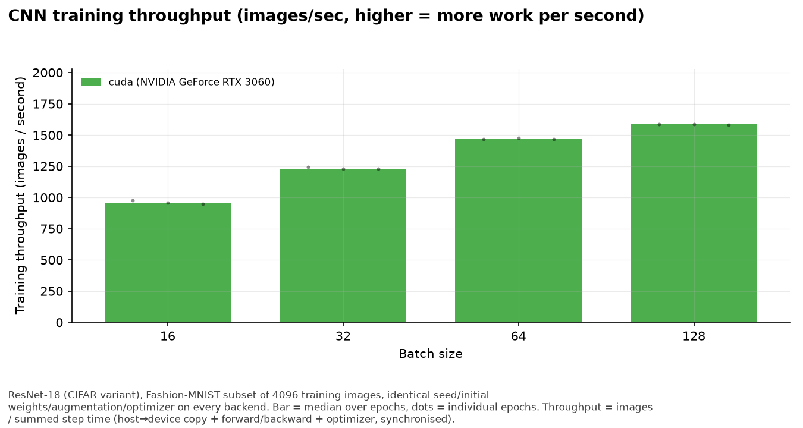
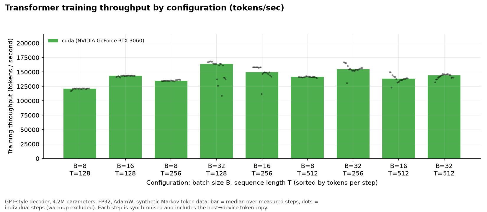

# ml-hardware-benchmark

A reproducible PyTorch benchmark suite that compares **CPU**, **Apple Silicon (MPS)** and **NVIDIA (CUDA)** on
identical workloads. It was built for the video *"Can You Use a MacBook for Machine Learning Training in 2026?"*.

The suite makes **no assumption about which backend is faster**. It records raw measurements, states them
factually and leaves interpretation to you. It never computes an overall "winner".

* Backends are detected automatically. An unavailable backend is recorded as `unavailable`, never skipped silently.
* Nothing ever falls back from one device to another. `PYTORCH_ENABLE_MPS_FALLBACK` is removed at import time, so an
  operator that MPS does not support raises and is recorded as `unsupported` instead of quietly running on the CPU.
* OOM, unsupported dtypes/operators and other errors are stored as data (`status`, `error_type`, `error`); the run continues.
* Every individual measurement, warmup included, is saved. Statistics are computed afterwards from the raw rows.

> **Status of this checkout.** Everything here was developed on a MacBook Pro with an **Apple M1 Pro, 32 GB unified
> memory**. The suite has since been run on that Mac (`mps`) and on a Linux machine with an **NVIDIA GeForce RTX 3060**
> (`cuda`, PyTorch 2.14+cu130); the two are compared in [Example results](#example-results). Every machine's numbers come
> from its own run, so check that run's `report.md` for what was actually measured, and use
> `scripts/compare_runs.py` to put several machines side by side. No `cpu` series has been recorded yet.

## Setup

```bash
python3.12 -m venv .venv          # 3.10+ works; 3.12 has the widest wheel support
source .venv/bin/activate
pip install -r requirements.txt   # optional for CUDA telemetry: pip install nvidia-ml-py
```

The CNN experiment downloads Fashion-MNIST (~30 MB) into `data/` on first use.

## Run everything

```bash
python scripts/run_all.py --backend auto --report      # every experiment on every available backend, then the report
```

`--backend auto` means "all three backends": unavailable ones get an `unavailable` row. Other forms:

```bash
python scripts/run_all.py --backend cpu
python scripts/run_all.py --backend mps
python scripts/run_all.py --backend cuda
python scripts/run_all.py --backend cpu,mps --config configs/default.yaml
```

Each (experiment, backend) pair runs in its own subprocess, so a crash in one cannot end the suite.
The default `sustained` experiment is **30 minutes per backend**; the full suite therefore takes on the order of hours on a laptop.

## Run individual experiments

```bash
python scripts/run_all.py --backend auto --experiment matmul
python scripts/run_all.py --backend auto --experiment cnn
python scripts/run_all.py --backend auto --experiment transformer
python scripts/run_all.py --backend auto --experiment memory
python scripts/run_all.py --backend auto --experiment precision
python scripts/run_all.py --backend auto --experiment rl
python scripts/run_all.py --backend auto --experiment sustained
# or call an experiment directly (same flags):
python experiments/benchmark_matmul.py --backend mps
```

Change any configuration value from the command line without editing YAML:

```bash
python scripts/run_all.py --backend mps --experiment sustained --set sustained.duration_minutes=5
python scripts/run_all.py --backend auto --experiment cnn --set cnn.train_samples=null --set cnn.epochs=5   # full Fashion-MNIST
```

## Generate the report

```bash
python scripts/generate_report.py                          # the run results/latest points at
python scripts/generate_report.py --run-id 20260919T160927   # a specific run
python scripts/generate_report.py --all-runs               # keep every run inside the folder, not just the newest per (experiment, backend)
```

It loads `results/<run_id>/raw/`, validates the data, writes aggregate tables, draws all plots and writes `results/<run_id>/report.md`.

## Compare runs from different machines

Each machine runs the suite for the backend(s) it has and gives the run a meaningful ID:

```bash
python scripts/run_all.py --backend cuda --run-id rtx3060-20260919      # on the NVIDIA machine
python scripts/run_all.py --backend mps,cpu --run-id m1pro-20260920     # on the Mac
```

Copy the run folders (`results/<run_id>/`, `raw/` is enough) into one `results/` directory, then:

```bash
python scripts/compare_runs.py rtx3060-20260919 m1pro-20260920                       # baseline = first run's first backend
python scripts/compare_runs.py rtx3060-20260919 m1pro-20260920 --baseline "cpu · Apple M1 Pro"
```

* Every available (machine, backend) becomes one **series**, labelled `<backend> · <device>`: `cuda · NVIDIA GeForce RTX 3060`,
  `mps · Apple M1 Pro (16-core GPU)`, `cpu · Intel Core i7-8700K @ 3.70GHz`. (`cuda` = NVIDIA GPU through CUDA, `mps` = Apple GPU through Metal,
  `cpu` = the host CPU.) A host name is appended only when two machines would get the same label.
* Output: `results/comparison/comparison.md`, `processed/*.csv` (values and speedups) and `plots/`, using the same plots as the per-run report.
* **Speedup** = median throughput of a series / median throughput of the baseline series, for the identical configuration. Pick a CPU series as
  `--baseline` to get the usual "×faster than CPU" numbers.
* **Comparability check.** The script warns when the compared runs differ in `code_sha256`, seed or an experiment's configuration
  (subset size, epochs, batch sizes, durations …); those numbers are not directly comparable, so run every machine with the same code and flags.
  Differences in torch / Python / OS versions are listed as context only.

## Where things are stored

| What | Where |
|---|---|
| Raw measurements (one row per measurement, CSV) | `results/<run_id>/raw/<experiment>__<backend>__<run_id>.csv` |
| Run metadata + full config (JSON) | `results/<run_id>/raw/<experiment>__<backend>__<run_id>.meta.json` |
| Suite manifest (return codes, durations) | `results/<run_id>/raw/run_all.json` |
| Aggregate tables (median/mean/std/CV/min/max, speedups) | `results/<run_id>/processed/*.csv` |
| Plots (PNG **and** SVG) | `results/<run_id>/plots/` |
| Markdown report | `results/<run_id>/report.md` |
| Newest run | `results/latest` (symlink to its folder) |
| Cross-machine comparison | `results/comparison/` (`comparison.md`, `processed/`, `plots/`) |

Each suite run gets its own folder named after its run ID (a timestamp, or whatever you pass with `--run-id`), so raw data, tables, plots and the report of one run always belong together.
| Configuration | `configs/default.yaml` |

## Project layout

```
configs/default.yaml     all experiment settings
src/devices.py           backend detection, explicit device selection, sync, seeding, placement guard
src/environment.py       metadata: host, OS, versions, CPU/GPU/RAM, power source, git commit + source hash
src/timing.py            synchronised timer (warmup, per-iteration samples)
src/metrics.py           statistics (median/mean/std/CV/min/max), speedup, degradation, memory tracking
src/reporting.py         result schema, streaming CSV writer, loader, validator, aggregation
src/runner.py            shared CLI + failure classification (oom / unsupported / error) for experiments
src/models.py            ResNet-18 (CIFAR), GPT-style transformer
src/workloads.py         seeded data pipelines, GPT training step
src/plotting.py          all plots (matplotlib, colours from the default cycle, one colour per backend)
experiments/             benchmark_matmul / resnet / transformer / memory / precision / rl / sustained
scripts/run_all.py       orchestrates experiments × backends
scripts/generate_report.py   report for one run folder
scripts/compare_runs.py      side-by-side comparison of several run folders (machines / backends)
tests/                   unit tests (python -m pytest)
```

## Result schema

Every raw CSV shares these columns; experiment-specific values go into the JSON column `extra`
(`generate_report.py` expands them to `x_<name>`).

`run_id, timestamp, experiment, backend, device, model, dataset, batch_size, sequence_length, precision, phase,
iteration, latency_ms, throughput, throughput_unit, memory_mb, memory_kind, loss, accuracy, status, error_type,
error, extra, metadata`

* `phase`: `warmup` (recorded, excluded from statistics), `measure`, or `config` (one row describing a whole
  configuration, used for memory summaries, failures and run summaries).
* `status`: `ok | oom | unsupported | unavailable | error | timeout | skipped`.
* `metadata` holds a compact fingerprint; the full metadata (timestamp, hostname, OS, Python/PyTorch/torchvision
  versions, device and GPU names, CPU, RAM, CUDA version, MPS availability, git commit, source hash, power source,
  seed, full configuration) is in the `.meta.json` file next to the CSV.

## The experiments

| # | Experiment | What is measured |
|---|---|---|
| 1 | `matmul` | `A @ B`, FP32, sizes 1024–8192: latency per call, GFLOPS, matmuls/s, memory; correctness vs. CPU FP32 |
| 2 | `cnn` | ResNet-18 (CIFAR variant) on a seeded Fashion-MNIST subset (28x28 padded to 32x32, 3 channels), batch sizes 16–128: epoch time, images/s, train loss, val accuracy, memory |
| 3 | `transformer` | 4.2M-parameter GPT-style model, batch × sequence-length grid: step time, tokens/s, loss, memory |
| 4 | `memory` | Batch / sequence-length / model-size ladders until failure; each config in a fresh subprocess |
| 5 | `precision` | FP32 / FP16 / BF16: pure-dtype matmul and autocast training: throughput, step time, loss, memory |
| 6 | `rl` | PPO on CartPole, two policy widths: env steps/s, gradient steps/s, total runtime, losses, time split env / inference / update |
| 7 | `sustained` | Repeated training for `duration_minutes` (default 30): throughput over time, degradation, telemetry where accessible |

## Example results

Backends are always labelled by what they are: **`cuda`** = NVIDIA GPU (CUDA), **`mps`** = Apple GPU (Metal), **`cpu`** = host CPU, followed by the device
name. The numbers below compare two series measured on two machines (FP32 without TF32, seed 1234):

| series | run | host | RAM | software |
|---|---|---|---|---|
| `cuda · NVIDIA GeForce RTX 3060` | `20260919T163805` | Intel Core i7-8700K, Linux 6.8 | 62.7 GB | PyTorch 2.14.0+cu130, Python 3.12.5 |
| `mps · Apple M1 Pro (16-core GPU)` | `20260919T172639` | MacBook Pro, macOS (Darwin 25.6.0) | 32 GB unified | PyTorch 2.14.0, Python 3.12.5 |

No `cpu` series was measured in these runs, so speedup is expressed against the **CUDA** series (baseline), not against a CPU: **>1 = higher throughput than the
RTX 3060**, <1 = lower. Full tables, CV/std and all plots are in each run's `report.md` and in `results/comparison/comparison.md`.

> **Comparability caveat.** `compare_runs.py` reports that the two runs are **not strictly comparable**: `code_sha256` differs between them
> (the benchmark sources were not identical on the two machines; for `sustained` the Mac run also differs from the Mac's other experiments).
> Seeds and experiment settings matched. Treat the numbers as indicative, and re-run both machines from one checkout to get a like-for-like comparison.
> Memory numbers are backend-specific (see [Memory metrics are NOT equivalent](#memory-metrics-are-not-equivalent)) and are not compared as speedups.

**Matrix multiplication** (FP32; median GFLOPS = 2n³ / latency)

| n | cuda · RTX 3060 (GFLOPS) | mps · M1 Pro (GFLOPS) | speedup (mps vs cuda) |
|---|---|---|---|
| 1024 | 6,812 | 2,823 | 0.41 |
| 2048 | 7,516 | 4,040 | 0.54 |
| 4096 | 7,604 | 4,055 | 0.53 |
| 8192 | 9,435 | 4,059 | 0.43 |


**CNN training** (ResNet-18, Fashion-MNIST subset of 4,096 images, 3 epochs; median images/s per epoch)

| batch size | cuda · RTX 3060 (images/s) | mps · M1 Pro (images/s) | speedup (mps vs cuda) | mps epoch time (s) | mps final val. acc. |
|---|---|---|---|---|---|
| 16 | 959 | 553 | 0.58 | 7.41 | 0.751 |
| 32 | 1,231 | 644 | 0.52 | 6.36 | 0.743 |
| 64 | 1,468 | 732 | 0.50 | 5.60 | 0.776 |
| 128 | 1,585 | 746 | 0.47 | 5.49 | 0.711 |

The CUDA epoch times were 4.27 / 3.33 / 2.79 / 2.58 s. Validation accuracy uses a 1,000-image subset after 3 epochs, so it is a sanity check that training works,
not a quality result.



**Transformer training** (4.2M-parameter GPT-style model; median tokens/s)

| batch \ sequence length | cuda 128 | cuda 256 | cuda 512 | mps 128 | mps 256 | mps 512 |
|---|---|---|---|---|---|---|
| 8 | 121,354 | 134,980 | 141,402 | 49,906 | 55,274 | 53,104 |
| 16 | 143,655 | 149,717 | 138,309 | 58,766 | 60,055 | 54,816 |
| 32 | 164,162 | 154,633 | 143,958 | 64,495 | 62,536 | 54,504 |

Across the nine configurations the M1 Pro reaches 0.38–0.41× the RTX 3060's tokens/s.



**Precision** (median throughput; speedup = mps vs cuda)

| workload | precision | cuda · RTX 3060 | mps · M1 Pro | speedup |
|---|---|---|---|---|
| matmul 4096×4096 (GFLOPS) | FP32 | 7,599 | 4,012 | 0.53 |
| matmul 4096×4096 (GFLOPS) | FP16 | 23,998 | 4,653 | 0.19 |
| matmul 4096×4096 (GFLOPS) | BF16 | 23,941 | 2,229 | 0.09 |
| GPT training step, autocast (tokens/s) | FP32 | 158,684 | 60,143 | 0.38 |
| GPT training step, autocast (tokens/s) | FP16 | 283,008 | 47,914 | 0.17 |
| GPT training step, autocast (tokens/s) | BF16 | 291,882 | 43,091 | 0.15 |

On the RTX 3060 half precision is faster than strict FP32 (about 3× for matmul, 1.8× for training). On the M1 Pro through MPS FP16/BF16 training is *slower* than FP32,
and BF16 matmul is slower than FP16 and FP32.


**Memory scaling** (largest configuration that ran; the two `memory_mb` values are different metrics and not comparable)

| ladder | cuda · RTX 3060 | mps · M1 Pro |
|---|---|---|
| batch size | up to 256 (8,394 MB); 512 out of memory (`OutOfMemoryError`) | up to 256 (11,561 MB); 512 stopped by the suite's system-memory safety cap (`SafetyCapSystemMemory`), not a native OOM |
| model size | ceiling reached: 206M parameters (4,568 MB) | ceiling reached: 206M parameters (6,267 MB) |
| sequence length | ceiling reached: 4,096 tokens (4,241 MB) | ceiling reached: 4,096 tokens (17,539 MB) |

CUDA memory is peak allocated tensor memory in dedicated VRAM (11.6 GiB); MPS memory is what the Metal driver holds in unified memory shared with the CPU and OS
(a sampled lower bound of the true peak).

**PPO / CartPole** (8 envs × 128 steps per iteration; median end-to-end env-steps/s)

| hidden width | cuda · RTX 3060 | mps · M1 Pro | speedup |
|---|---|---|---|
| 64 | 9,448 | 4,997 | 0.53 |
| 512 | 9,107 | 4,478 | 0.49 |

Gradient-step throughput: cuda 341 / 332 steps/s, mps 207 / 174 steps/s (width 64 / 512).


**Sustained training** (10 min)

| | cuda · RTX 3060 | mps · M1 Pro |
|---|---|---|
| average tokens/s | 139,755 | 59,359 |
| first→last 10% of windows (positive = slower at the end) | +4.10% | −0.18% |
| GPU telemetry | median utilisation 98%, 87 °C, 121 W | not collected (needs `sudo powermetrics`) |


### How to read these numbers

* **Median, CV.** Every number is the median of repeated synchronised measurements (warm-up excluded). CV = std / mean; values around 0.01 mean the
  repeats agree within about 1%, large values (e.g. 0.13 for the transformer at batch 32 × 128) flag a noisy configuration.
* **GFLOPS** is the *achieved* matmul rate for the given size and dtype, not the hardware's theoretical peak. Small matrices underuse a large GPU,
  which is why throughput changes with `n`.
* **Batch size** changes throughput (images/s, tokens/s) because larger batches keep the device busier; epoch time is what the same amount of work costs in seconds.
* **Precision.** Half precision is only faster if the hardware and kernels support it; FP32 here is strict FP32 (TF32 off), so FP16/BF16 gains are measured against that.
* **Memory** is the backend's own metric (`cuda` = peak allocated tensor memory; `mps` = driver-held memory) and must not be compared across backends, which is why the memory table above lists values but no speedup.
* **Speedup** (in `compare_runs.py` output and the per-run report) is throughput relative to a baseline series; it is meaningful only when both series ran the
  identical configuration.

## Methodology

* **Same workload.** Model weights, data subsets, augmentation and token streams are created on the CPU from a fixed seed
  (`seed: 1234`) and copied to the device once; every backend gets identical inputs. GPU kernels are not bit-deterministic, so
  training trajectories can drift slightly between backends (visible in the loss columns).
* **Synchronised timing.** Each timed call is `sync → t0 → work → sync → t1` with `torch.cuda.synchronize()`,
  `torch.mps.synchronize()`, and nothing on CPU. The sync cost is part of every measurement on every backend.
* **Warm-up.** Warm-up iterations run first (GPU kernel compilation, clock ramp-up). Small workloads remain noisy;
  the coefficient of variation is reported so you can see it.
* **Baseline for speedups.** Always `speedup = cpu_time / backend_time` for the identical configuration on the same machine.
  Values below 1 mean *slower than the CPU baseline*. There is no aggregate score.
* **Eager mode, defaults.** No `torch.compile`, no fused optimizers, strict FP32 (TF32 disabled; `numerics.allow_tf32` in the config).
  Software-stack differences (Accelerate/AMX on Apple CPUs, MPS kernels, cuDNN) are part of what is compared, so results describe
  *hardware + PyTorch backend together*, not silicon alone.
* **Training-step scope.** Steps include the host→device copy of the batch and `loss.item()`; the CNN data augmentation is applied
  on the CPU per epoch *before* timing (identical, seeded) and is reported separately.

## Metric definitions and how to interpret them

| Metric | Meaning | Reading it |
|---|---|---|
| **latency** (`latency_ms`) | Wall time of one call / step | Lower is better. Compare medians, look at CV. |
| **throughput** (`throughput`) | Work per second; unit in `throughput_unit` | Higher is better. Only compare within the same unit and configuration. |
| **GFLOPS** | `2·n³ / latency` for `n×n` matmul | Achieved rate, not the hardware's theoretical peak. |
| **samples/s, images/s** | Training examples processed per second | Depends on batch size. |
| **tokens/s** | `batch × sequence / step time` | Transformer analogue of images/s. |
| **training time / epoch time** | Sum of step times of an epoch | Wall time of the training phase only. |
| **median / mean / std / CV** | Distribution of repeated measurements | Median is the headline; CV = std/mean flags noisy results. |
| **speedup vs CPU** | `cpu_time / backend_time` | Same configuration only; <1 = slower than the baseline. |
| **degradation %** | `(first-10% median − last-10% median) / first` for sustained throughput | Positive = slower at the end (e.g. thermal throttling). |
| **env steps/s (env only)** | Simulator speed, always on the CPU | Independent of the accelerator. |
| **end-to-end env steps/s** | Env steps / whole PPO iteration | Includes policy round trips and the update. |
| **gradient steps/s** | Minibatch updates / update time | Neural-network training speed only. |
| **largest successful configuration** | Last ok value on a ladder | Says how *large* a workload fits, not how *fast* it runs. |

### Memory metrics are NOT equivalent

`memory_mb` always comes with a `memory_kind` label. Do not compare absolute values across backends.

| Backend | What `memory_mb` is | Caveats |
|---|---|---|
| CUDA | `torch.cuda.max_memory_allocated` (exact peak of tensor allocations); reserved memory is stored in `extra` | Dedicated VRAM. Excludes CUDA context and allocator cache. |
| MPS | `torch.mps.driver_allocated_memory` (what the Metal driver holds for the process, including allocator cache). Where sampled, the maximum polled every 5 ms; `current_allocated_memory` (tensor bytes only) is stored in `extra` | **PyTorch exposes no peak counter for MPS**, so this is a snapshot or a sampled lower bound of the true peak. Includes a fixed floor of roughly 1 GiB, so small workloads look alike. Unified memory is shared with the CPU and the OS. |
| CPU | Process RSS: snapshot, sampled maximum, or lifetime peak (`ru_maxrss`), as labelled | Includes the Python/torch baseline; OS-managed, can include shared pages. |

In the memory-scaling experiment, unified-memory machines can start swapping instead of failing, so the suite enforces safety limits
(MPS memory fraction, CPU RSS cap, minimum system memory, per-configuration timeout). A ladder ended by one of these limits is
reported as `SafetyCap*` — *stopped by this suite*, not a native OOM.

## Limitations discovered while building this (Apple M1 Pro, 32 GB, PyTorch 2.14)

* **One machine per run.** The example numbers come from an RTX 3060 machine (`cuda`) and an M1 Pro Mac (`mps`) whose sources were not byte-identical
  (`code_sha256` differs, see the caveat under Example results); `cpu` results depend on the host CPU, so combine machines with `scripts/compare_runs.py`
  and run each from the same checkout. CUDA telemetry (GPU utilisation, temperature, power) is read
  through `nvidia-smi` / NVML; the OS CPU speed limit is not collected on Linux.
* **CPU matmul runs on Apple's AMX matrix units via Accelerate**, giving ~1.6 TFLOPS that is *independent of the thread count*
  (1 thread ≈ 10 threads). A pure-NEON CPU would be far slower, so "CPU" on Apple Silicon is unusually strong for large FP32 matmuls,
  and this is a property of the software stack too.
* **MPS has no peak-memory API** and no way to detect silent CPU fallback beyond disabling it (done here).
* **GPU utilisation / power / temperature on Apple Silicon require `sudo powermetrics`**, which the suite does not require; those
  telemetry fields are stored as `null` with the reason. Only the OS thermal speed limit (`pmset -g therm`) is collected.
* **Half precision does not imply speed-up.** On this machine FP16/BF16 behave very differently per backend (see the precision section of the report; CPU half-precision is software-emulated and far slower).
* **Laptop conditions matter.** The power source (AC/battery) and low-power mode are recorded per run; keep the machine plugged in and idle for the video runs.
* **The checkout is not a git repository**, so `git_commit` is `null`; a SHA-256 of all sources (`code_sha256`) is recorded instead.
* **CNN default uses a 4096-image Fashion-MNIST subset** because the CPU trains at tens of images/s; set `cnn.train_samples=null` for the full dataset.
* **Sustained default is 30 minutes.** Shorter runs are possible (`--set sustained.duration_minutes=N`) and are labelled by their real duration in the report.

## Tests

```bash
python -m pytest -q
```
