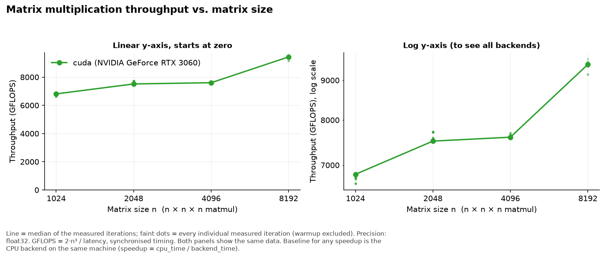
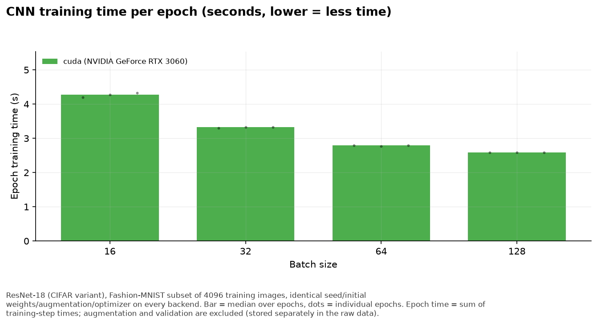
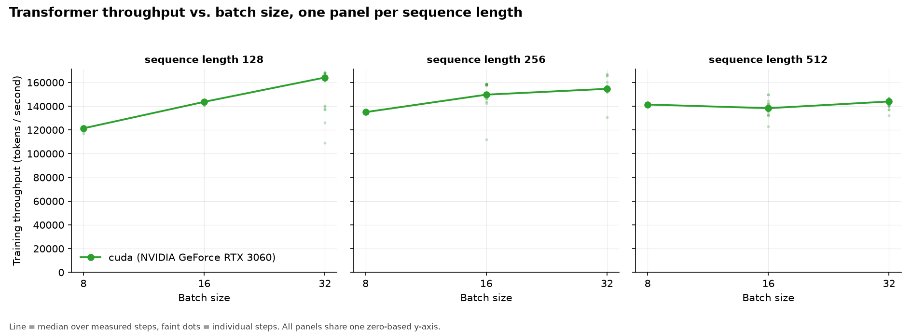
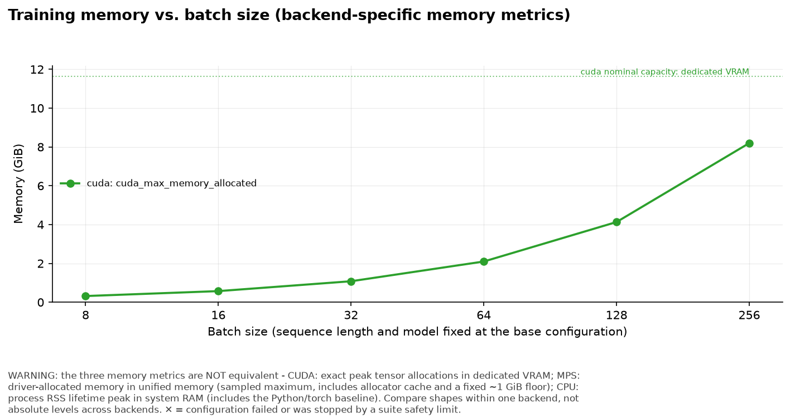
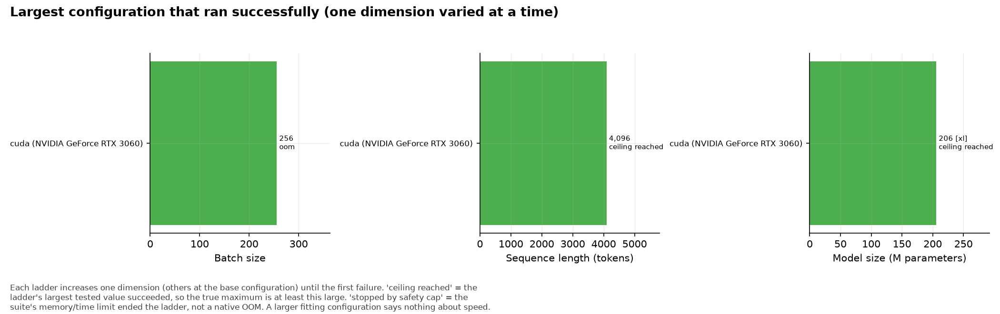
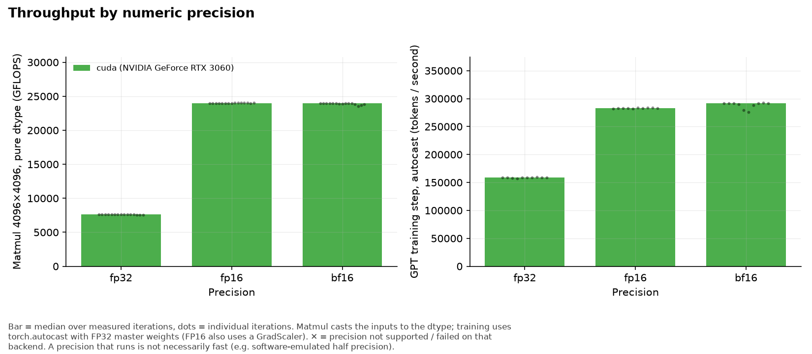
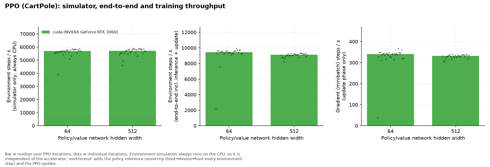
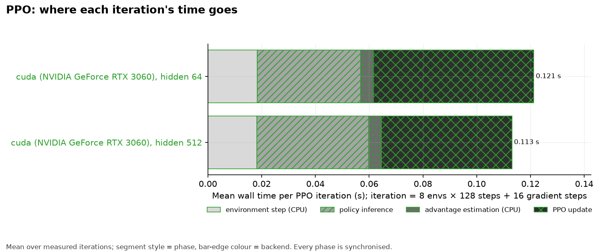
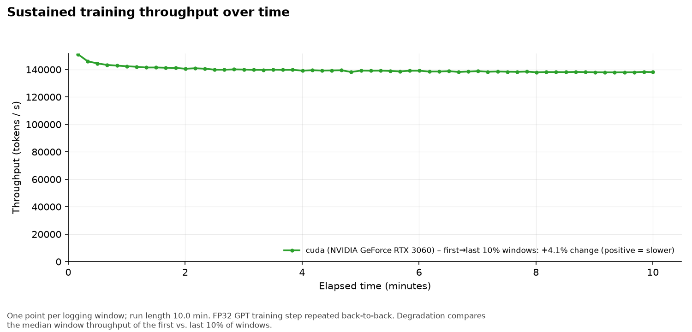

# ML hardware benchmark report

_All numbers below come from the raw measurements in this run's `raw/` folder. This report lists observations only; interpretation is left to the reader._

## Hardware

| backend | available | device | CPU | GPU | RAM (GB) | power |
|---|---|---|---|---|---|---|
| cuda | True | NVIDIA GeForce RTX 3060 | Intel(R) Core(TM) i7-8700K CPU @ 3.70GHz | NVIDIA GeForce RTX 3060 | 62.73 | – |

## Environment

| experiment | backend | run_id | timestamp | host | OS | python | torch | torchvision | seed | torch_threads | git | code_sha256 |
|---|---|---|---|---|---|---|---|---|---|---|---|---|
| cnn | cuda | 20260919T163805 | 2026-09-19T16:38:14+07:00 | kimang-ubuntu | Linux 6.8.0-139-generic | 3.12.5 | 2.14.0+cu130 | 0.29.0+cu130 | 1234 | 6 | 02ef55fdd8ca475c0661076be05396562212d8b7 | 2aca8dcddc402f2b |
| matmul | cuda | 20260919T163805 | 2026-09-19T16:38:08+07:00 | kimang-ubuntu | Linux 6.8.0-139-generic | 3.12.5 | 2.14.0+cu130 | 0.29.0+cu130 | 1234 | 6 | 02ef55fdd8ca475c0661076be05396562212d8b7 | 2aca8dcddc402f2b |
| memory | cuda | 20260919T163805 | 2026-09-19T16:39:16+07:00 | kimang-ubuntu | Linux 6.8.0-139-generic | 3.12.5 | 2.14.0+cu130 | 0.29.0+cu130 | 1234 | 6 | 02ef55fdd8ca475c0661076be05396562212d8b7 | 2aca8dcddc402f2b |
| precision | cuda | 20260919T163805 | 2026-09-19T16:40:28+07:00 | kimang-ubuntu | Linux 6.8.0-139-generic | 3.12.5 | 2.14.0+cu130 | 0.29.0+cu130 | 1234 | 6 | 02ef55fdd8ca475c0661076be05396562212d8b7 | 2aca8dcddc402f2b |
| rl | cuda | 20260919T163805 | 2026-09-19T16:40:34+07:00 | kimang-ubuntu | Linux 6.8.0-139-generic | 3.12.5 | 2.14.0+cu130 | 0.29.0+cu130 | 1234 | 6 | 02ef55fdd8ca475c0661076be05396562212d8b7 | 2aca8dcddc402f2b |
| sustained | cuda | 20260919T163805 | 2026-09-19T16:40:47+07:00 | kimang-ubuntu | Linux 6.8.0-139-generic | 3.12.5 | 2.14.0+cu130 | 0.29.0+cu130 | 1234 | 6 | 02ef55fdd8ca475c0661076be05396562212d8b7 | 666a5c5368fc5724 |
| transformer | cuda | 20260919T163805 | 2026-09-19T16:39:03+07:00 | kimang-ubuntu | Linux 6.8.0-139-generic | 3.12.5 | 2.14.0+cu130 | 0.29.0+cu130 | 1234 | 6 | 02ef55fdd8ca475c0661076be05396562212d8b7 | 2aca8dcddc402f2b |

**Data validation:** no problems found.

## Methodology

* **Same workload, same seed.** Inputs and initial weights are generated on the CPU from a fixed seed and copied to the device once, so every backend starts from identical values. GPU kernels are not bit-deterministic, so training trajectories can drift slightly between backends.
* **Synchronised timing.** Each timed iteration is `sync → start → work → sync → stop` (`torch.cuda.synchronize()`, `torch.mps.synchronize()`, nothing on CPU). Warmup iterations are recorded but excluded from statistics. Every individual measurement is stored in `results/raw/`.
* **Statistics.** Median is the headline number; mean, sample standard deviation, coefficient of variation (std/mean), min and max are reported alongside it.
* **No silent fallback.** Each backend is selected explicitly. `PYTORCH_ENABLE_MPS_FALLBACK` is removed so operators unsupported on MPS raise instead of quietly running on the CPU; those are recorded as `unsupported`. Unavailable backends are recorded as `unavailable`.
* **Failures are data.** OOM, unsupported dtypes/operators and other errors are stored with `status`, `error_type` and `error` and the run continues.
* **Eager mode, default kernels.** No `torch.compile`, no fused optimizers, strict FP32 (TF32 disabled) unless the config says otherwise.
* **Baseline.** Speedups are always `cpu_time / backend_time` for the identical configuration on the same machine. There is no aggregate score.

### Metric definitions and memory-metric differences

* `latency_ms` – wall time of one call. `throughput` – work per second; its unit is in `throughput_unit` (GFLOPS, images/s, tokens/s, env-steps/s).
* **CUDA memory** – `torch.cuda.max_memory_allocated` (exact peak of tensor allocations; reserved memory is stored in `extra`). Dedicated VRAM.
* **MPS memory** – PyTorch has no peak counter. `driver_allocated_memory` is what the Metal driver holds for the process (including cache), taken as a snapshot or, where marked, a sampled maximum (lower bound of the true peak). Unified memory is shared with the CPU.
* **CPU memory** – process RSS (snapshot, sampled maximum, or lifetime peak as labelled in `memory_kind`); includes the Python/torch baseline.
* **These memory numbers are NOT equivalent across backends.** Compare trends within a backend, not absolute values across backends.

# Experiment results

## Experiment 1: Matrix multiplication (A @ B)

Latency per `A @ B` (ms), throughput in GFLOPS (2n³ / latency). `speedup_vs_cpu` = cpu median latency / backend median latency (CPU is the baseline; <1 means slower than the CPU baseline). `memory_mb` is backend-specific, see the metric notes.

| backend | precision | matrix_size | n | lat_ms_median | lat_ms_mean | lat_ms_std | lat_ms_cv | gflops_median | matmuls_per_sec_median | memory_mb | speedup_vs_cpu |
|---|---|---|---|---|---|---|---|---|---|---|---|
| cuda | float32 | 1024 | 100 | 0.315 | 0.316 | 0.00207 | 0.00655 | 6,812.218 | 3,172.186 | 20.125 | – |
| cuda | float32 | 2048 | 50 | 2.286 | 2.272 | 0.024 | 0.011 | 7,516.297 | 437.506 | 56.125 | – |
| cuda | float32 | 4096 | 30 | 18.074 | 18.050 | 0.091 | 0.00504 | 7,604.212 | 55.328 | 200.125 | – |
| cuda | float32 | 8192 | 10 | 116.543 | 116.995 | 1.825 | 0.016 | 9,434.532 | 8.580 | 776.125 | – |

  
_(also saved as `plots/01_matmul_throughput_vs_size.svg`)_

## Experiment 2: CNN training (ResNet-18 / Fashion-MNIST)

`n` = number of measured epochs. Epoch time = summed step time (host→device copy, forward, backward, optimizer step; synchronised). `speedup_vs_cpu` = cpu epoch time / backend epoch time (baseline = CPU). `memory_mb` is backend-specific (see notes). The first epoch includes warm-up effects not covered by the warm-up steps.

| backend | batch_size | n | epoch_s_median | epoch_s_mean | epoch_s_std | epoch_s_cv | images_per_s_median | final_train_loss | final_val_acc | memory_mb | speedup_vs_cpu |
|---|---|---|---|---|---|---|---|---|---|---|---|
| cuda | 16 | 3 | 4.270 | 4.265 | 0.062 | 0.015 | 959.207 | 0.759 | 0.725 | 718.006 | – |
| cuda | 32 | 3 | 3.327 | 3.318 | 0.017 | 0.00501 | 1,231.086 | 0.747 | 0.610 | 718.131 | – |
| cuda | 64 | 3 | 2.790 | 2.784 | 0.012 | 0.00424 | 1,468.300 | 0.707 | 0.740 | 719.631 | – |
| cuda | 128 | 3 | 2.584 | 2.586 | 0.00308 | 0.00119 | 1,584.847 | 0.686 | 0.720 | 747.367 | – |

  
_(also saved as `plots/02_cnn_images_per_sec.svg`)_

  
_(also saved as `plots/03_cnn_epoch_time.svg`)_

## Experiment 3: Transformer training

Step time = one synchronised training step (ms); `tokens_per_s` = batch × sequence / step time. `speedup_vs_cpu` = cpu step time / backend step time (baseline = CPU). `memory_mb` is backend-specific (see notes). Loss should fall towards ln(4) ≈ 1.39 on the synthetic Markov data.

| backend | batch_size | sequence_length | n | step_ms_median | step_ms_mean | step_ms_std | step_ms_cv | tokens_per_s_median | loss_first | loss_last | memory_mb | speedup_vs_cpu |
|---|---|---|---|---|---|---|---|---|---|---|---|---|
| cuda | 8 | 128 | 20 | 8.438 | 8.468 | 0.085 | 0.010 | 121,354 | 8.336 | 8.194 | 196.680 | – |
| cuda | 8 | 256 | 20 | 15.173 | 15.142 | 0.095 | 0.00628 | 134,980 | 8.325 | 8.089 | 327.322 | – |
| cuda | 8 | 512 | 20 | 28.967 | 28.965 | 0.166 | 0.00573 | 141,402 | 8.295 | 7.905 | 587.355 | – |
| cuda | 16 | 128 | 20 | 14.256 | 14.300 | 0.096 | 0.00675 | 143,655 | 8.317 | 8.085 | 326.946 | – |
| cuda | 16 | 256 | 20 | 27.358 | 27.379 | 2.385 | 0.087 | 149,717 | 8.301 | 7.935 | 586.603 | – |
| cuda | 16 | 512 | 20 | 59.230 | 59.296 | 2.637 | 0.044 | 138,309 | 8.275 | 7.753 | 1,107.917 | – |
| cuda | 32 | 128 | 20 | 24.951 | 26.744 | 3.544 | 0.132 | 164,162 | 8.302 | 7.986 | 586.227 | – |
| cuda | 32 | 256 | 20 | 52.977 | 52.870 | 2.756 | 0.052 | 154,633 | 8.280 | 7.773 | 1,107.166 | – |
| cuda | 32 | 512 | 20 | 113.812 | 114.982 | 3.257 | 0.028 | 143,958 | 8.248 | 7.602 | 2,149.042 | – |

  
_(also saved as `plots/04_transformer_tokens_per_sec.svg`)_

  
_(also saved as `plots/05_transformer_throughput_vs_batch_size.svg`)_

## Experiment 4: Memory scaling

Every configuration is one training step run in a fresh subprocess. A ladder stops at its first failure. Memory capacity says how *large* a workload fits, not how *fast* it runs. `ended_by_safety_cap` = the ladder was stopped by this suite's memory/time limit (needed because unified-memory machines swap instead of failing), not by a native out-of-memory error.

### Largest successful configuration per dimension

| backend | ladder | largest_ok_model | largest_ok_batch | largest_ok_seq | largest_ok_params_M | memory_mb_at_largest_ok | ladder_ended_by | ended_by_safety_cap |
|---|---|---|---|---|---|---|---|---|
| cuda | batch_size | small | 256.0 | 256.0 | 4.3 | 8,394.2 | oom (OutOfMemoryError) at small bs=512 seq=256 | False |
| cuda | model | xl | 8.0 | 256.0 | 206.0 | 4,568.3 | ladder ceiling reached (no failure) | False |
| cuda | sequence_length | small | 8.0 | 4,096.0 | 5.3 | 4,240.9 | ladder ceiling reached (no failure) | False |

### All configurations tried

| backend | model | batch_size | sequence_length | params | status | error_type | memory_mb | step_ms | tokens_per_s |
|---|---|---|---|---|---|---|---|---|---|
| cuda | small | 8.0 | 256.0 | 4,273,664 | ok | – | 325.4 | 15.3 | 133,930 |
| cuda | small | 16.0 | 256.0 | 4,273,664 | ok | – | 585.7 | 25.9 | 157,952 |
| cuda | small | 32.0 | 256.0 | 4,273,664 | ok | – | 1,106.3 | 48.6 | 168,427 |
| cuda | small | 64.0 | 256.0 | 4,273,664 | ok | – | 2,147.4 | 92.4 | 177,221 |
| cuda | small | 128.0 | 256.0 | 4,273,664 | ok | – | 4,229.7 | 177.1 | 185,053 |
| cuda | small | 256.0 | 256.0 | 4,273,664 | ok | – | 8,394.2 | 354.8 | 184,733 |
| cuda | small | 512.0 | 256.0 | 4,273,664 | oom | OutOfMemoryError | – | – | – |
| cuda | small | 8.0 | 128.0 | 4,240,896 | ok | – | 196.7 | 8.6 | 119,040 |
| cuda | small | 8.0 | 256.0 | 4,273,664 | ok | – | 325.4 | 15.5 | 132,478 |
| cuda | small | 8.0 | 512.0 | 4,339,200 | ok | – | 586.5 | 29.8 | 137,665 |
| cuda | small | 8.0 | 1,024.0 | 4,470,272 | ok | – | 1,108.5 | 66.1 | 123,986 |
| cuda | small | 8.0 | 2,048.0 | 4,732,416 | ok | – | 2,152.7 | 172.4 | 95,037.6 |
| cuda | small | 8.0 | 4,096.0 | 5,256,704 | ok | – | 4,240.9 | 510.3 | 64,217.5 |
| cuda | tiny | 8.0 | 256.0 | 953,856 | ok | – | 190.3 | 5.2 | 396,138 |
| cuda | small | 8.0 | 256.0 | 4,273,664 | ok | – | 325.4 | 15.4 | 132,629 |
| cuda | medium | 8.0 | 256.0 | 27,448,320 | ok | – | 984.2 | 70.9 | 28,894.7 |
| cuda | large | 8.0 | 256.0 | 88,398,336 | ok | – | 2,322.4 | 204.7 | 10,003.3 |
| cuda | xl | 8.0 | 256.0 | 205,998,080 | ok | – | 4,568.3 | 450.5 | 4,546.0 |

Memory metric per backend: **cuda** = cuda_max_memory_allocated (exact peak of tensor allocations).

Nominal memory capacity: **cuda** 11.6 GiB (dedicated VRAM).

  
_(also saved as `plots/06_memory_vs_batch_size.svg`)_

  
_(also saved as `plots/07_max_successful_configuration.svg`)_

## Experiment 5: Precision (FP32 / FP16 / BF16)

`speedup_vs_cpu` compares like for like: same workload and precision against the CPU backend (baseline). GFLOPS for matmul, tokens/s for training. A precision appears here only if it actually ran; failures are listed in the failure section. Throughput in a lower precision is not automatically higher - see the numbers.

| backend | workload | precision | n | latency_ms_median | latency_ms_cv | throughput_median | loss_first | loss_last | memory_mb | speedup_vs_cpu |
|---|---|---|---|---|---|---|---|---|---|---|
| cuda | matmul_pure_dtype | bf16 | 15 | 5.741 | 0.00511 | 23,941.387 | – | – | 104.125 | – |
| cuda | matmul_pure_dtype | fp16 | 15 | 5.727 | 0.00085 | 23,998.395 | – | – | 104.125 | – |
| cuda | matmul_pure_dtype | fp32 | 15 | 18.085 | 0.00363 | 7,599.409 | – | – | 200.125 | – |
| cuda | training_autocast | bf16 | 10 | 14.033 | 0.021 | 291,882 | 8.319 | 8.163 | 447.728 | – |
| cuda | training_autocast | fp16 | 10 | 14.473 | 0.00185 | 283,008 | 8.319 | 8.163 | 447.729 | – |
| cuda | training_autocast | fp32 | 10 | 25.812 | 0.00427 | 158,684 | 8.319 | 8.163 | 585.728 | – |

  
_(also saved as `plots/08_precision_fp32_fp16_bf16.svg`)_

## Experiment 6: Reinforcement learning (PPO / CartPole)

Times are means per PPO iteration (8 envs × 128 steps, then 4 epochs of minibatch updates); `total_runtime_s` sums all measured iterations. `speedup_vs_cpu` = cpu iteration time / backend iteration time (baseline = CPU). `return_last` = mean return of the last 20 finished episodes (learning sanity check).

| backend | hidden | n | total_runtime_s | env_s | infer_s | gae_s | update_s | env_only_sps_median | end2end_sps_median | train_sps_median | policy_loss_last | value_loss_last | return_last | speedup_vs_cpu |
|---|---|---|---|---|---|---|---|---|---|---|---|---|---|---|
| cuda | 64 | 30 | 3.638 | 0.018 | 0.039 | 0.00471 | 0.060 | 56,875.140 | 9,448.055 | 340.695 | -0.00065 | 69.300 | 161.900 | – |
| cuda | 512 | 30 | 3.394 | 0.018 | 0.042 | 0.00473 | 0.049 | 57,094.879 | 9,106.832 | 331.634 | -0.00572 | 23.277 | 168.200 | – |

  
_(also saved as `plots/09_ppo_throughput.svg`)_

  
_(also saved as `plots/09b_ppo_time_breakdown.svg`)_

## Experiment 7: Sustained training

`degradation_pct` = 100 × (first-10%-windows median − last-10%-windows median) / first; positive means throughput fell during the run. Samples = sequences, tokens = samples × sequence length.

| backend | duration_min | windows | avg_tokens_per_s | median_window_tokens_per_s | first10pct_median | last10pct_median | degradation_pct | total_tokens | total_samples | final_loss | memory_mb |
|---|---|---|---|---|---|---|---|---|---|---|---|
| cuda | 10.00 | 60 | 139,755 | 139,162 | 143,888 | 137,995 | 4.10 | 83,857,408 | 327,568 | 0.00506 | 585.73 |

### Telemetry availability

| backend | metric | collected | median_value | reason / note |
|---|---|---|---|---|
| cuda | GPU utilisation | yes | 98.0 |  |
| cuda | temperature | yes | 87.0 |  |
| cuda | power | yes | 121.0 |  |
| cuda | OS CPU speed limit | no | – | no reason recorded |

  
_(also saved as `plots/10_sustained_throughput_over_time.svg`)_

## Failed, unsupported and unavailable configurations

| experiment | backend | status | model | batch_size | sequence_length | precision | error_type | error | rows |
|---|---|---|---|---|---|---|---|---|---|
| memory | cuda | oom | small | 512.00 | 256.00 | fp32 | OutOfMemoryError | OutOfMemoryError: CUDA out of memory. Tried to allocate 2.00 GiB. GPU 0 has a total capacity of 11.63 GiB of which 1.02 GiB is free. Including non-PyTorch memory, this process has 10.44 GiB memory in  | 1 |

## MPS limitations encountered

* PyTorch exposes no peak-memory counter for MPS; memory values are driver allocation snapshots/sampled maxima (see metric notes).
* CPU fallback for unsupported MPS operators is disabled on purpose, so an unsupported operator shows up as a recorded failure instead of a hidden slowdown.
* GPU utilisation, temperature and power on Apple Silicon need `sudo powermetrics`, which this suite does not require; those fields are stored as null.
* No MPS-specific failures were recorded in this data set.

## Observations

Factual statements generated from the data above; no overall ranking is implied.

* Matmul n=1024 (float32): median throughput – cuda 6,812 GFLOPS (0.32 ms).
* Matmul n=2048 (float32): median throughput – cuda 7,516 GFLOPS (2.29 ms).
* Matmul n=4096 (float32): median throughput – cuda 7,604 GFLOPS (18.07 ms).
* Matmul n=8192 (float32): median throughput – cuda 9,435 GFLOPS (116.54 ms).
* Max relative difference vs. CPU FP32 result: cuda n=1024: 4.49e-07; cuda n=2048: 1.79e-06.
* CNN training throughput [batch_size=16]: median – cuda 959 images/s.
* CNN training throughput [batch_size=32]: median – cuda 1,231 images/s.
* CNN training throughput [batch_size=64]: median – cuda 1,468 images/s.
* CNN training throughput [batch_size=128]: median – cuda 1,585 images/s.
* CNN final validation accuracy [batch_size=16]: median – cuda 0.725 (top-1).
* CNN final validation accuracy [batch_size=32]: median – cuda 0.610 (top-1).
* CNN final validation accuracy [batch_size=64]: median – cuda 0.740 (top-1).
* CNN final validation accuracy [batch_size=128]: median – cuda 0.720 (top-1).
* Transformer throughput [batch_size=8, sequence_length=128]: median – cuda 121,354 tokens/s.
* Transformer throughput [batch_size=8, sequence_length=256]: median – cuda 134,980 tokens/s.
* Transformer throughput [batch_size=8, sequence_length=512]: median – cuda 141,402 tokens/s.
* Transformer throughput [batch_size=16, sequence_length=128]: median – cuda 143,655 tokens/s.
* Transformer throughput [batch_size=16, sequence_length=256]: median – cuda 149,717 tokens/s.
* Transformer throughput [batch_size=16, sequence_length=512]: median – cuda 138,309 tokens/s.
* Transformer throughput [batch_size=32, sequence_length=128]: median – cuda 164,162 tokens/s.
* Transformer throughput [batch_size=32, sequence_length=256]: median – cuda 154,633 tokens/s.
* Transformer throughput [batch_size=32, sequence_length=512]: median – cuda 143,958 tokens/s.
* Memory ladder 'batch_size' on cuda: largest successful value 256; ladder ended by: oom (OutOfMemoryError) at small bs=512 seq=256.
* Memory ladder 'model' on cuda: largest successful value 2.06e+08 (xl, 206M params); ladder ended by: ladder ceiling reached (no failure).
* Memory ladder 'sequence_length' on cuda: largest successful value 4,096; ladder ended by: ladder ceiling reached (no failure).
* Precision (matmul_pure_dtype) [precision=bf16]: median – cuda 23,941 GFLOPS.
* Precision (matmul_pure_dtype) [precision=fp16]: median – cuda 23,998 GFLOPS.
* Precision (matmul_pure_dtype) [precision=fp32]: median – cuda 7,599 GFLOPS.
* Precision (training_autocast) [precision=bf16]: median – cuda 291,882 tokens/s.
* Precision (training_autocast) [precision=fp16]: median – cuda 283,008 tokens/s.
* Precision (training_autocast) [precision=fp32]: median – cuda 158,684 tokens/s.
* PPO end-to-end throughput [hidden=64]: median – cuda 9,448 env-steps/s.
* PPO end-to-end throughput [hidden=512]: median – cuda 9,107 env-steps/s.
* PPO gradient-step throughput [hidden=64]: median – cuda 341 grad-steps/s.
* PPO gradient-step throughput [hidden=512]: median – cuda 332 grad-steps/s.
* Sustained run on cuda: 10.0 min, average 139,755 tokens/s, median window 139,162 tokens/s, first→last 10% windows 4.10% change (positive = slower); 83,857,408 tokens (327,568 samples) processed.
