# ML hardware benchmark report

_All numbers below come from the raw measurements in this run's `raw/` folder. This report lists observations only; interpretation is left to the reader._

## Hardware

| backend | available | device | CPU | GPU | RAM (GB) | power |
|---|---|---|---|---|---|---|
| mps | True | Apple M1 Pro (16-core GPU) | Apple M1 Pro | Apple M1 Pro (16-core GPU) | 32.00 | AC Power |

## Environment

| experiment | backend | run_id | timestamp | host | OS | python | torch | torchvision | seed | torch_threads | git | code_sha256 |
|---|---|---|---|---|---|---|---|---|---|---|---|---|
| cnn | mps | 20260919T172639 | 2026-09-19T17:26:51+07:00 | Kims-MacBook-Pro-16.local | Darwin 25.6.0 | 3.12.5 | 2.14.0 | 0.29.0 | 1234 | 8 | 2c24789d48523ca307f7e9c6d6bded783520cc40 | ad2062058ca50491 |
| matmul | mps | 20260919T172639 | 2026-09-19T17:26:41+07:00 | Kims-MacBook-Pro-16.local | Darwin 25.6.0 | 3.12.5 | 2.14.0 | 0.29.0 | 1234 | 8 | 2c24789d48523ca307f7e9c6d6bded783520cc40 | ad2062058ca50491 |
| memory | mps | 20260919T172639 | 2026-09-19T17:28:43+07:00 | Kims-MacBook-Pro-16.local | Darwin 25.6.0 | 3.12.5 | 2.14.0 | 0.29.0 | 1234 | 8 | 2c24789d48523ca307f7e9c6d6bded783520cc40 | ad2062058ca50491 |
| precision | mps | 20260919T172639 | 2026-09-19T17:30:06+07:00 | Kims-MacBook-Pro-16.local | Darwin 25.6.0 | 3.12.5 | 2.14.0 | 0.29.0 | 1234 | 8 | 2c24789d48523ca307f7e9c6d6bded783520cc40 | ad2062058ca50491 |
| rl | mps | 20260919T172639 | 2026-09-19T17:30:16+07:00 | Kims-MacBook-Pro-16.local | Darwin 25.6.0 | 3.12.5 | 2.14.0 | 0.29.0 | 1234 | 8 | 2c24789d48523ca307f7e9c6d6bded783520cc40 | ad2062058ca50491 |
| sustained | mps | 20260919T172639 | 2026-09-19T17:30:33+07:00 | Kims-MacBook-Pro-16.local | Darwin 25.6.0 | 3.12.5 | 2.14.0 | 0.29.0 | 1234 | 8 | 2c24789d48523ca307f7e9c6d6bded783520cc40 | ad2062058ca50491 |
| transformer | mps | 20260919T172639 | 2026-09-19T17:28:18+07:00 | Kims-MacBook-Pro-16.local | Darwin 25.6.0 | 3.12.5 | 2.14.0 | 0.29.0 | 1234 | 8 | 2c24789d48523ca307f7e9c6d6bded783520cc40 | ad2062058ca50491 |

**Data validation:** no problems found.

## Methodology

* **Same workload, same seed.** Inputs and initial weights are generated on the CPU from a fixed seed and copied to the device once, so every backend starts from identical values. GPU kernels are not bit-deterministic, so training trajectories can drift slightly between backends.
* **Synchronised timing.** Each timed iteration is `sync → start → work → sync → stop` (`torch.cuda.synchronize()`, `torch.mps.synchronize()`, nothing on CPU). Warmup iterations are recorded but excluded from statistics. Every individual measurement is stored in `results/raw/`.
* **Statistics.** Median is the headline number; mean, sample standard deviation, coefficient of variation (std/mean), min and max are reported alongside it.
* **No silent fallback.** Each backend is selected explicitly. `PYTORCH_ENABLE_MPS_FALLBACK` is removed so operators unsupported on MPS raise instead of quietly running on the CPU; those are recorded as `unsupported`. Unavailable backends are recorded as `unavailable`.
* **Failures are data.** OOM, unsupported dtypes/operators and other errors are stored with `status`, `error_type` and `error` and the run continues.
* **Eager mode, default kernels.** No `torch.compile`, no fused optimizers, strict FP32 (TF32 disabled) unless the config says otherwise.
* **Baseline.** Speedups are always `cpu_time / backend_time` for the identical configuration on the same machine. There is no aggregate score.

### Metric definitions and memory-metric differences

* `latency_ms` – wall time of one call. `throughput` – work per second; its unit is in `throughput_unit` (GFLOPS, images/s, tokens/s, env-steps/s).
* **CUDA memory** – `torch.cuda.max_memory_allocated` (exact peak of tensor allocations; reserved memory is stored in `extra`). Dedicated VRAM.
* **MPS memory** – PyTorch has no peak counter. `driver_allocated_memory` is what the Metal driver holds for the process (including cache), taken as a snapshot or, where marked, a sampled maximum (lower bound of the true peak). Unified memory is shared with the CPU.
* **CPU memory** – process RSS (snapshot, sampled maximum, or lifetime peak as labelled in `memory_kind`); includes the Python/torch baseline.
* **These memory numbers are NOT equivalent across backends.** Compare trends within a backend, not absolute values across backends.

# Experiment results

## Experiment 1: Matrix multiplication (A @ B)

Latency per `A @ B` (ms), throughput in GFLOPS (2n³ / latency). `speedup_vs_cpu` = cpu median latency / backend median latency (CPU is the baseline; <1 means slower than the CPU baseline). `memory_mb` is backend-specific, see the metric notes.

| backend | precision | matrix_size | n | lat_ms_median | lat_ms_mean | lat_ms_std | lat_ms_cv | gflops_median | matmuls_per_sec_median | memory_mb | speedup_vs_cpu |
|---|---|---|---|---|---|---|---|---|---|---|---|
| mps | float32 | 1024 | 100 | 0.761 | 0.768 | 0.031 | 0.040 | 2,823.391 | 1,314.744 | 32.391 | – |
| mps | float32 | 2048 | 50 | 4.252 | 4.339 | 0.394 | 0.091 | 4,040.144 | 235.167 | 1,024.391 | – |
| mps | float32 | 4096 | 30 | 33.895 | 34.197 | 1.139 | 0.033 | 4,054.805 | 29.503 | 1,024.375 | – |
| mps | float32 | 8192 | 10 | 270.878 | 271.185 | 5.105 | 0.019 | 4,059.165 | 3.692 | 1,024.375 | – |

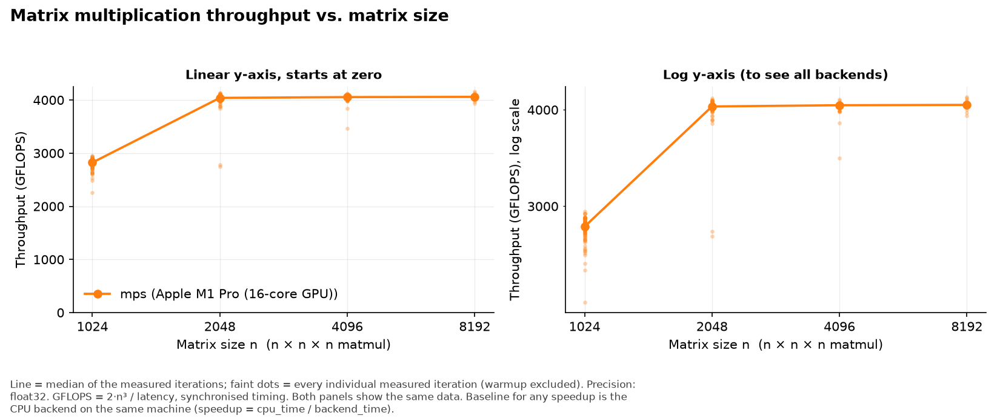  
_(also saved as `plots/01_matmul_throughput_vs_size.svg`)_

## Experiment 2: CNN training (ResNet-18 / Fashion-MNIST)

`n` = number of measured epochs. Epoch time = summed step time (host→device copy, forward, backward, optimizer step; synchronised). `speedup_vs_cpu` = cpu epoch time / backend epoch time (baseline = CPU). `memory_mb` is backend-specific (see notes). The first epoch includes warm-up effects not covered by the warm-up steps.

| backend | batch_size | n | epoch_s_median | epoch_s_mean | epoch_s_std | epoch_s_cv | images_per_s_median | final_train_loss | final_val_acc | memory_mb | speedup_vs_cpu |
|---|---|---|---|---|---|---|---|---|---|---|---|
| mps | 16 | 3 | 7.407 | 7.500 | 0.170 | 0.023 | 552.954 | 0.782 | 0.751 | 1,319.094 | – |
| mps | 32 | 3 | 6.362 | 6.420 | 0.184 | 0.029 | 643.788 | 0.801 | 0.743 | 1,404.094 | – |
| mps | 64 | 3 | 5.599 | 5.634 | 0.074 | 0.013 | 731.535 | 0.697 | 0.776 | 1,172.094 | – |
| mps | 128 | 3 | 5.488 | 5.502 | 0.026 | 0.00479 | 746.323 | 0.681 | 0.711 | 1,290.094 | – |

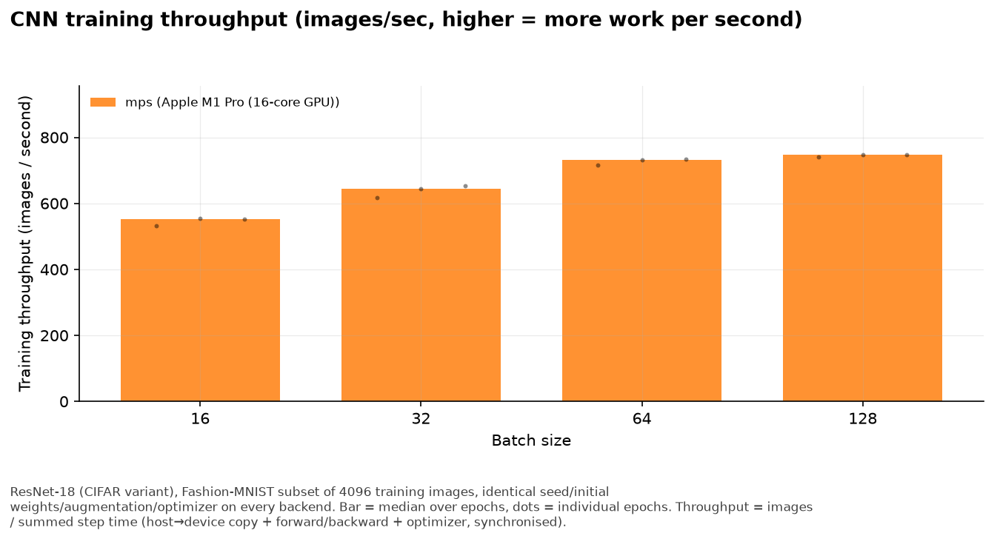  
_(also saved as `plots/02_cnn_images_per_sec.svg`)_

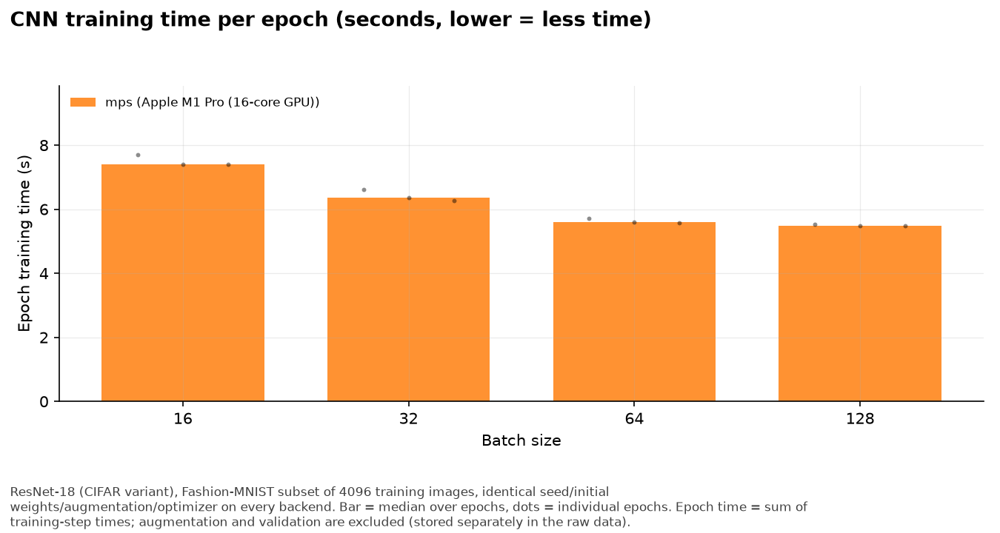  
_(also saved as `plots/03_cnn_epoch_time.svg`)_

## Experiment 3: Transformer training

Step time = one synchronised training step (ms); `tokens_per_s` = batch × sequence / step time. `speedup_vs_cpu` = cpu step time / backend step time (baseline = CPU). `memory_mb` is backend-specific (see notes). Loss should fall towards ln(4) ≈ 1.39 on the synthetic Markov data.

| backend | batch_size | sequence_length | n | step_ms_median | step_ms_mean | step_ms_std | step_ms_cv | tokens_per_s_median | loss_first | loss_last | memory_mb | speedup_vs_cpu |
|---|---|---|---|---|---|---|---|---|---|---|---|---|
| mps | 8 | 128 | 20 | 20.519 | 20.634 | 0.484 | 0.023 | 49,905.782 | 8.336 | 8.194 | 1,194.734 | – |
| mps | 8 | 256 | 20 | 37.052 | 37.382 | 1.060 | 0.028 | 55,274.231 | 8.325 | 8.089 | 1,330.719 | – |
| mps | 8 | 512 | 20 | 77.131 | 77.640 | 1.000 | 0.013 | 53,104.360 | 8.295 | 7.905 | 1,266.719 | – |
| mps | 16 | 128 | 20 | 34.850 | 35.154 | 1.104 | 0.031 | 58,765.671 | 8.317 | 8.085 | 1,394.719 | – |
| mps | 16 | 256 | 20 | 68.204 | 68.618 | 1.139 | 0.017 | 60,055.349 | 8.301 | 7.935 | 1,250.719 | – |
| mps | 16 | 512 | 20 | 149.445 | 150.153 | 1.534 | 0.010 | 54,815.998 | 8.275 | 7.753 | 2,346.719 | – |
| mps | 32 | 128 | 20 | 63.509 | 63.951 | 1.050 | 0.016 | 64,494.896 | 8.302 | 7.986 | 1,378.719 | – |
| mps | 32 | 256 | 20 | 130.997 | 131.458 | 1.209 | 0.0092 | 62,535.813 | 8.280 | 7.773 | 2,338.719 | – |
| mps | 32 | 512 | 20 | 300.602 | 300.630 | 1.864 | 0.0062 | 54,504.026 | 8.248 | 7.602 | 3,434.719 | – |

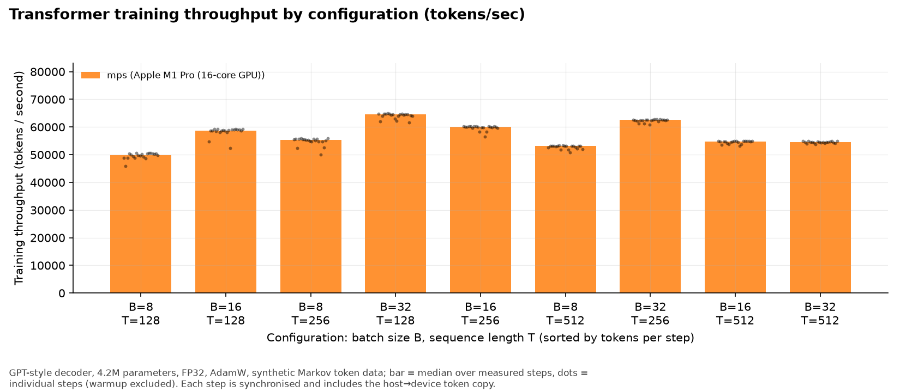  
_(also saved as `plots/04_transformer_tokens_per_sec.svg`)_

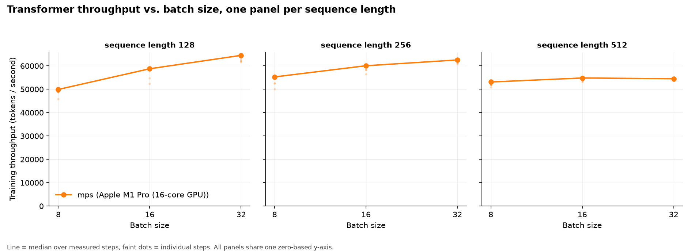  
_(also saved as `plots/05_transformer_throughput_vs_batch_size.svg`)_

## Experiment 4: Memory scaling

Every configuration is one training step run in a fresh subprocess. A ladder stops at its first failure. Memory capacity says how *large* a workload fits, not how *fast* it runs. `ended_by_safety_cap` = the ladder was stopped by this suite's memory/time limit (needed because unified-memory machines swap instead of failing), not by a native out-of-memory error.

### Largest successful configuration per dimension

| backend | ladder | largest_ok_model | largest_ok_batch | largest_ok_seq | largest_ok_params_M | memory_mb_at_largest_ok | ladder_ended_by | ended_by_safety_cap |
|---|---|---|---|---|---|---|---|---|
| mps | batch_size | small | 256.0 | 256.0 | 4.3 | 11,560.7 | oom (SafetyCapSystemMemory) at small bs=512 seq=256 | True |
| mps | model | xl | 8.0 | 256.0 | 206.0 | 6,266.8 | ladder ceiling reached (no failure) | False |
| mps | sequence_length | small | 8.0 | 4,096.0 | 5.3 | 17,538.7 | ladder ceiling reached (no failure) | False |

### All configurations tried

| backend | model | batch_size | sequence_length | params | status | error_type | memory_mb | mps_tensor_bytes_mb | step_ms | tokens_per_s |
|---|---|---|---|---|---|---|---|---|---|---|
| mps | small | 8.0 | 256.0 | 4,273,664 | ok | – | 1,314.8 | 308.5 | 43.2 | 47,381.5 |
| mps | small | 16.0 | 256.0 | 4,273,664 | ok | – | 1,218.8 | 536.6 | 67.6 | 60,572.5 |
| mps | small | 32.0 | 256.0 | 4,273,664 | ok | – | 2,274.8 | 1,184.9 | 130.9 | 62,566.5 |
| mps | small | 64.0 | 256.0 | 4,273,664 | ok | – | 3,426.8 | 2,353.6 | 261.8 | 62,577.5 |
| mps | small | 128.0 | 256.0 | 4,273,664 | ok | – | 5,738.8 | 4,690.8 | 524.9 | 62,430.2 |
| mps | small | 256.0 | 256.0 | 4,273,664 | ok | – | 11,560.7 | 8,341.8 | 2,340.8 | 27,997.8 |
| mps | small | 512.0 | 256.0 | – | oom | SafetyCapSystemMemory | – | – | – | – |
| mps | small | 8.0 | 128.0 | 4,240,896 | ok | – | 1,194.8 | 154.3 | 26.1 | 39,188.0 |
| mps | small | 8.0 | 256.0 | 4,273,664 | ok | – | 1,314.8 | 308.5 | 43.1 | 47,493.5 |
| mps | small | 8.0 | 512.0 | 4,339,200 | ok | – | 1,218.8 | 664.9 | 78.5 | 52,162.1 |
| mps | small | 8.0 | 1,024.0 | 4,470,272 | ok | – | 2,282.8 | 1,569.7 | 188.2 | 43,521.3 |
| mps | small | 8.0 | 2,048.0 | 4,732,416 | ok | – | 5,986.8 | 4,217.3 | 525.0 | 31,206.3 |
| mps | small | 8.0 | 4,096.0 | 5,256,704 | ok | – | 17,538.7 | 14,556.3 | 1,800.3 | 18,201.2 |
| mps | tiny | 8.0 | 256.0 | 953,856 | ok | – | 1,162.8 | 181.7 | 18.1 | 113,033 |
| mps | small | 8.0 | 256.0 | 4,273,664 | ok | – | 1,314.8 | 308.5 | 43.1 | 47,478.9 |
| mps | medium | 8.0 | 256.0 | 27,448,320 | ok | – | 1,266.8 | 1,034.4 | 161.7 | 12,662.3 |
| mps | large | 8.0 | 256.0 | 88,398,336 | ok | – | 3,410.7 | 2,561.1 | 450.7 | 4,544.4 |
| mps | xl | 8.0 | 256.0 | 205,998,080 | ok | – | 6,266.8 | 4,986.0 | 958.4 | 2,136.8 |

Memory metric per backend: **mps** = mps_driver_allocated_memory (sampled max, lower bound of peak; includes allocator cache).

Nominal memory capacity: **mps** 25.0 GiB (Metal recommended max working set (unified memory)).

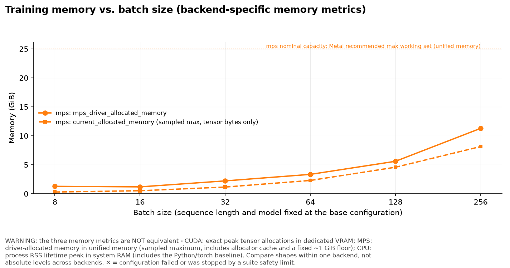  
_(also saved as `plots/06_memory_vs_batch_size.svg`)_

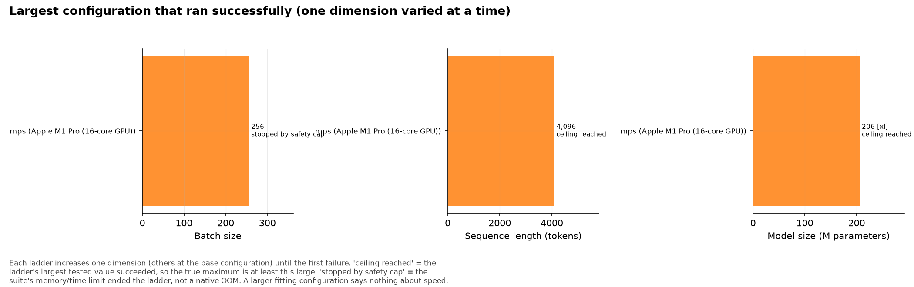  
_(also saved as `plots/07_max_successful_configuration.svg`)_

## Experiment 5: Precision (FP32 / FP16 / BF16)

`speedup_vs_cpu` compares like for like: same workload and precision against the CPU backend (baseline). GFLOPS for matmul, tokens/s for training. A precision appears here only if it actually ran; failures are listed in the failure section. Throughput in a lower precision is not automatically higher - see the numbers.

| backend | workload | precision | n | latency_ms_median | latency_ms_cv | throughput_median | loss_first | loss_last | memory_mb | speedup_vs_cpu |
|---|---|---|---|---|---|---|---|---|---|---|
| mps | matmul_pure_dtype | bf16 | 15 | 61.670 | 0.016 | 2,228.615 | – | – | 1,024.375 | – |
| mps | matmul_pure_dtype | fp16 | 15 | 29.537 | 0.019 | 4,653.072 | – | – | 1,024.375 | – |
| mps | matmul_pure_dtype | fp32 | 15 | 34.259 | 0.021 | 4,011.733 | – | – | 1,024.391 | – |
| mps | training_autocast | bf16 | 10 | 95.055 | 0.00806 | 43,090.936 | 8.319 | 8.163 | 1,226.719 | – |
| mps | training_autocast | fp16 | 10 | 85.496 | 0.029 | 47,914.126 | 8.319 | 8.163 | 1,226.719 | – |
| mps | training_autocast | fp32 | 10 | 68.104 | 0.021 | 60,143.389 | 8.319 | 8.163 | 1,218.719 | – |

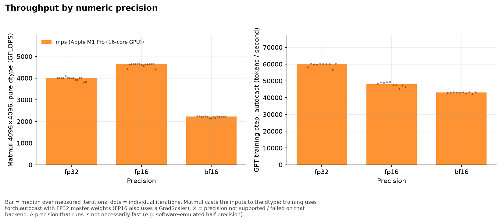  
_(also saved as `plots/08_precision_fp32_fp16_bf16.svg`)_

## Experiment 6: Reinforcement learning (PPO / CartPole)

Times are means per PPO iteration (8 envs × 128 steps, then 4 epochs of minibatch updates); `total_runtime_s` sums all measured iterations. `speedup_vs_cpu` = cpu iteration time / backend iteration time (baseline = CPU). `return_last` = mean return of the last 20 finished episodes (learning sanity check).

| backend | hidden | n | total_runtime_s | env_s | infer_s | gae_s | update_s | env_only_sps_median | end2end_sps_median | train_sps_median | policy_loss_last | value_loss_last | return_last | speedup_vs_cpu |
|---|---|---|---|---|---|---|---|---|---|---|---|---|---|---|
| mps | 64 | 30 | 6.282 | 0.00943 | 0.118 | 0.00172 | 0.080 | 111,124 | 4,997.169 | 207.079 | -0.000829 | 69.305 | 161.900 | – |
| mps | 512 | 30 | 7.015 | 0.00974 | 0.124 | 0.00174 | 0.098 | 106,839 | 4,478.475 | 174.167 | -0.00296 | 29.318 | 232.900 | – |

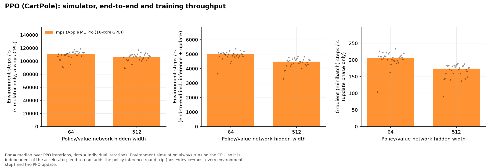  
_(also saved as `plots/09_ppo_throughput.svg`)_

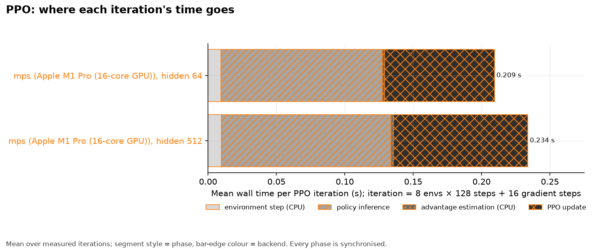  
_(also saved as `plots/09b_ppo_time_breakdown.svg`)_

## Experiment 7: Sustained training

`degradation_pct` = 100 × (first-10%-windows median − last-10%-windows median) / first; positive means throughput fell during the run. Samples = sequences, tokens = samples × sequence length.

| backend | duration_min | windows | avg_tokens_per_s | median_window_tokens_per_s | first10pct_median | last10pct_median | degradation_pct | total_tokens | total_samples | final_loss | memory_mb |
|---|---|---|---|---|---|---|---|---|---|---|---|
| mps | 10.00 | 60 | 59,358.74 | 59,476.30 | 59,310.81 | 59,420.49 | -0.18 | 35,618,816 | 139,136 | 0.00837 | 1,218.72 |

### Telemetry availability

| backend | metric | collected | median_value | reason / note |
|---|---|---|---|---|
| mps | GPU utilisation | no | – | Apple Silicon GPU sensors need `sudo powermetrics`; not collected (no root required by this suite) |
| mps | temperature | no | – | Apple Silicon GPU sensors need `sudo powermetrics`; not collected (no root required by this suite) |
| mps | power | no | – | Apple Silicon GPU sensors need `sudo powermetrics`; not collected (no root required by this suite) |
| mps | OS CPU speed limit | yes | 100.0 | pmset reported no thermal limit; 100 means 'no throttling reported by the OS', not a measured clock |

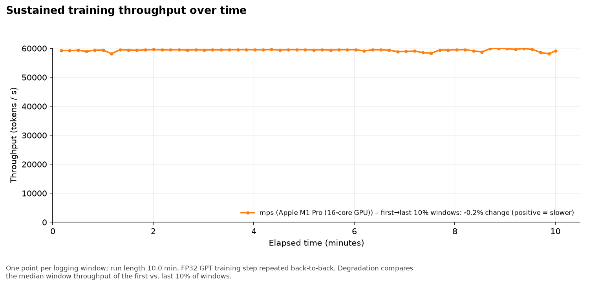  
_(also saved as `plots/10_sustained_throughput_over_time.svg`)_

## Failed, unsupported and unavailable configurations

| experiment | backend | status | model | batch_size | sequence_length | precision | error_type | error | rows |
|---|---|---|---|---|---|---|---|---|---|
| memory | mps | oom | small | 512.00 | 256.00 | fp32 | SafetyCapSystemMemory | killed: system available memory fell below 2.0 GB; a suite safety limit, not a native OOM | 1 |

## MPS limitations encountered

* PyTorch exposes no peak-memory counter for MPS; memory values are driver allocation snapshots/sampled maxima (see metric notes).
* CPU fallback for unsupported MPS operators is disabled on purpose, so an unsupported operator shows up as a recorded failure instead of a hidden slowdown.
* GPU utilisation, temperature and power on Apple Silicon need `sudo powermetrics`, which this suite does not require; those fields are stored as null.

Recorded MPS failures:

| experiment | status | error_type | error | rows |
|---|---|---|---|---|
| memory | oom | SafetyCapSystemMemory | killed: system available memory fell below 2.0 GB; a suite safety limit, not a native OOM | 1 |

## Observations

Factual statements generated from the data above; no overall ranking is implied.

* Matmul n=1024 (float32): median throughput – mps 2,823 GFLOPS (0.76 ms).
* Matmul n=2048 (float32): median throughput – mps 4,040 GFLOPS (4.25 ms).
* Matmul n=4096 (float32): median throughput – mps 4,055 GFLOPS (33.90 ms).
* Matmul n=8192 (float32): median throughput – mps 4,059 GFLOPS (270.88 ms).
* Max relative difference vs. CPU FP32 result: mps n=1024: 0.00e+00; mps n=2048: 0.00e+00.
* CNN training throughput [batch_size=16]: median – mps 553 images/s.
* CNN training throughput [batch_size=32]: median – mps 644 images/s.
* CNN training throughput [batch_size=64]: median – mps 732 images/s.
* CNN training throughput [batch_size=128]: median – mps 746 images/s.
* CNN final validation accuracy [batch_size=16]: median – mps 0.751 (top-1).
* CNN final validation accuracy [batch_size=32]: median – mps 0.743 (top-1).
* CNN final validation accuracy [batch_size=64]: median – mps 0.776 (top-1).
* CNN final validation accuracy [batch_size=128]: median – mps 0.711 (top-1).
* Transformer throughput [batch_size=8, sequence_length=128]: median – mps 49,906 tokens/s.
* Transformer throughput [batch_size=8, sequence_length=256]: median – mps 55,274 tokens/s.
* Transformer throughput [batch_size=8, sequence_length=512]: median – mps 53,104 tokens/s.
* Transformer throughput [batch_size=16, sequence_length=128]: median – mps 58,766 tokens/s.
* Transformer throughput [batch_size=16, sequence_length=256]: median – mps 60,055 tokens/s.
* Transformer throughput [batch_size=16, sequence_length=512]: median – mps 54,816 tokens/s.
* Transformer throughput [batch_size=32, sequence_length=128]: median – mps 64,495 tokens/s.
* Transformer throughput [batch_size=32, sequence_length=256]: median – mps 62,536 tokens/s.
* Transformer throughput [batch_size=32, sequence_length=512]: median – mps 54,504 tokens/s.
* Memory ladder 'batch_size' on mps: largest successful value 256; ladder ended by: oom (SafetyCapSystemMemory) at small bs=512 seq=256.
* Memory ladder 'model' on mps: largest successful value 2.06e+08 (xl, 206M params); ladder ended by: ladder ceiling reached (no failure).
* Memory ladder 'sequence_length' on mps: largest successful value 4,096; ladder ended by: ladder ceiling reached (no failure).
* Precision (matmul_pure_dtype) [precision=bf16]: median – mps 2,229 GFLOPS.
* Precision (matmul_pure_dtype) [precision=fp16]: median – mps 4,653 GFLOPS.
* Precision (matmul_pure_dtype) [precision=fp32]: median – mps 4,012 GFLOPS.
* Precision (training_autocast) [precision=bf16]: median – mps 43,091 tokens/s.
* Precision (training_autocast) [precision=fp16]: median – mps 47,914 tokens/s.
* Precision (training_autocast) [precision=fp32]: median – mps 60,143 tokens/s.
* PPO end-to-end throughput [hidden=64]: median – mps 4,997 env-steps/s.
* PPO end-to-end throughput [hidden=512]: median – mps 4,478 env-steps/s.
* PPO gradient-step throughput [hidden=64]: median – mps 207 grad-steps/s.
* PPO gradient-step throughput [hidden=512]: median – mps 174 grad-steps/s.
* Sustained run on mps: 10.0 min, average 59,359 tokens/s, median window 59,476 tokens/s, first→last 10% windows -0.18% change (positive = slower); 35,618,816 tokens (139,136 samples) processed.
