# Cross-machine comparison

_2 series from 2 run folder(s). Speedup = median throughput / median throughput of the baseline series **cuda · NVIDIA GeForce RTX 3060**. Measurements only; nothing is ranked._

## Series

| series | run folder | host | CPU | GPU | RAM (GB) | OS | torch | python |
|---|---|---|---|---|---|---|---|---|
| cuda · NVIDIA GeForce RTX 3060 | 20260919T163805 | kimang-ubuntu | Intel(R) Core(TM) i7-8700K CPU @ 3.70GHz | NVIDIA GeForce RTX 3060 | 62.73 | Linux 6.8.0-139-generic | 2.14.0+cu130 | 3.12.5 |
| mps · Apple M1 Pro (16-core GPU) | 20260919T172639 | Kims-MacBook-Pro-16.local | Apple M1 Pro | Apple M1 Pro (16-core GPU) | 32.00 | Darwin 25.6.0 | 2.14.0 | 3.12.5 |

## Comparability

**These runs used different code, seeds or experiment settings, so the affected numbers are NOT directly comparable:**

* **cnn**: mps · Apple M1 Pro (16-core GPU) vs cuda · NVIDIA GeForce RTX 3060: `code_sha256` differs (2aca8dcddc402f2b vs ad2062058ca50491)
* **matmul**: mps · Apple M1 Pro (16-core GPU) vs cuda · NVIDIA GeForce RTX 3060: `code_sha256` differs (2aca8dcddc402f2b vs ad2062058ca50491)
* **memory**: mps · Apple M1 Pro (16-core GPU) vs cuda · NVIDIA GeForce RTX 3060: `code_sha256` differs (2aca8dcddc402f2b vs ad2062058ca50491)
* **precision**: mps · Apple M1 Pro (16-core GPU) vs cuda · NVIDIA GeForce RTX 3060: `code_sha256` differs (2aca8dcddc402f2b vs ad2062058ca50491)
* **rl**: mps · Apple M1 Pro (16-core GPU) vs cuda · NVIDIA GeForce RTX 3060: `code_sha256` differs (2aca8dcddc402f2b vs ad2062058ca50491)
* **sustained**: mps · Apple M1 Pro (16-core GPU) vs cuda · NVIDIA GeForce RTX 3060: `code_sha256` differs (666a5c5368fc5724 vs ad2062058ca50491)
* **transformer**: mps · Apple M1 Pro (16-core GPU) vs cuda · NVIDIA GeForce RTX 3060: `code_sha256` differs (2aca8dcddc402f2b vs ad2062058ca50491)

Software stack differences (expected across machines; part of what is being compared):

* cnn: mps · Apple M1 Pro (16-core GPU) vs cuda · NVIDIA GeForce RTX 3060: torch 2.14.0 vs 2.14.0+cu130, os Darwin 25.6.0 vs Linux 6.8.0-139-generic
* matmul: mps · Apple M1 Pro (16-core GPU) vs cuda · NVIDIA GeForce RTX 3060: torch 2.14.0 vs 2.14.0+cu130, os Darwin 25.6.0 vs Linux 6.8.0-139-generic
* memory: mps · Apple M1 Pro (16-core GPU) vs cuda · NVIDIA GeForce RTX 3060: torch 2.14.0 vs 2.14.0+cu130, os Darwin 25.6.0 vs Linux 6.8.0-139-generic
* precision: mps · Apple M1 Pro (16-core GPU) vs cuda · NVIDIA GeForce RTX 3060: torch 2.14.0 vs 2.14.0+cu130, os Darwin 25.6.0 vs Linux 6.8.0-139-generic
* rl: mps · Apple M1 Pro (16-core GPU) vs cuda · NVIDIA GeForce RTX 3060: torch 2.14.0 vs 2.14.0+cu130, os Darwin 25.6.0 vs Linux 6.8.0-139-generic
* sustained: mps · Apple M1 Pro (16-core GPU) vs cuda · NVIDIA GeForce RTX 3060: torch 2.14.0 vs 2.14.0+cu130, os Darwin 25.6.0 vs Linux 6.8.0-139-generic
* transformer: mps · Apple M1 Pro (16-core GPU) vs cuda · NVIDIA GeForce RTX 3060: torch 2.14.0 vs 2.14.0+cu130, os Darwin 25.6.0 vs Linux 6.8.0-139-generic

## Results

_Memory numbers are backend-specific and not equivalent across backends (see the per-run reports). Throughput for very small workloads is noisy; check `lat_ms_cv` in the per-run reports._

### Matrix multiplication

Values: median GFLOPS (2n³ / latency).

| precision | matrix_size | cuda · NVIDIA GeForce RTX 3060 | mps · Apple M1 Pro (16-core GPU) |
|---|---|---|---|
| float32 | 1024 | 6,812.2 | 2,823.4 |
| float32 | 2048 | 7,516.3 | 4,040.1 |
| float32 | 4096 | 7,604.2 | 4,054.8 |
| float32 | 8192 | 9,434.5 | 4,059.2 |

Speedup vs **cuda · NVIDIA GeForce RTX 3060** (>1 = higher throughput than the baseline):

| precision | matrix_size | mps · Apple M1 Pro (16-core GPU) |
|---|---|---|
| float32 | 1024 | 0.41 |
| float32 | 2048 | 0.54 |
| float32 | 4096 | 0.53 |
| float32 | 8192 | 0.43 |

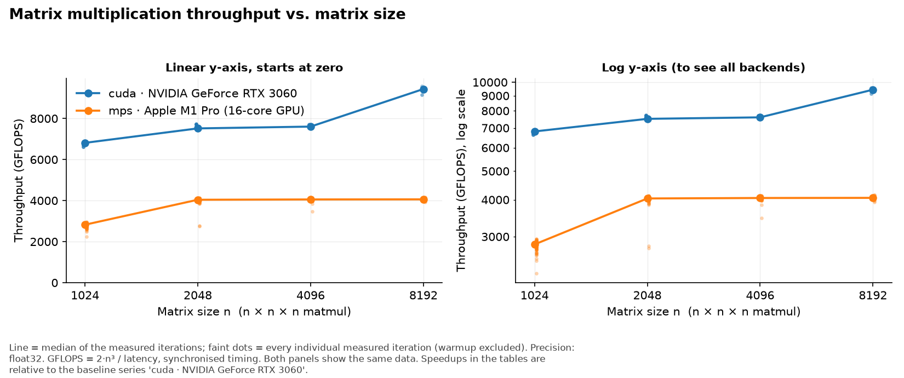

### CNN training (ResNet-18 / Fashion-MNIST)

Values: median images/s per epoch.

| batch_size | cuda · NVIDIA GeForce RTX 3060 | mps · Apple M1 Pro (16-core GPU) |
|---|---|---|
| 16 | 959.2 | 553.0 |
| 32 | 1,231.1 | 643.8 |
| 64 | 1,468.3 | 731.5 |
| 128 | 1,584.8 | 746.3 |

Speedup vs **cuda · NVIDIA GeForce RTX 3060** (>1 = higher throughput than the baseline):

| batch_size | mps · Apple M1 Pro (16-core GPU) |
|---|---|
| 16 | 0.58 |
| 32 | 0.52 |
| 64 | 0.50 |
| 128 | 0.47 |

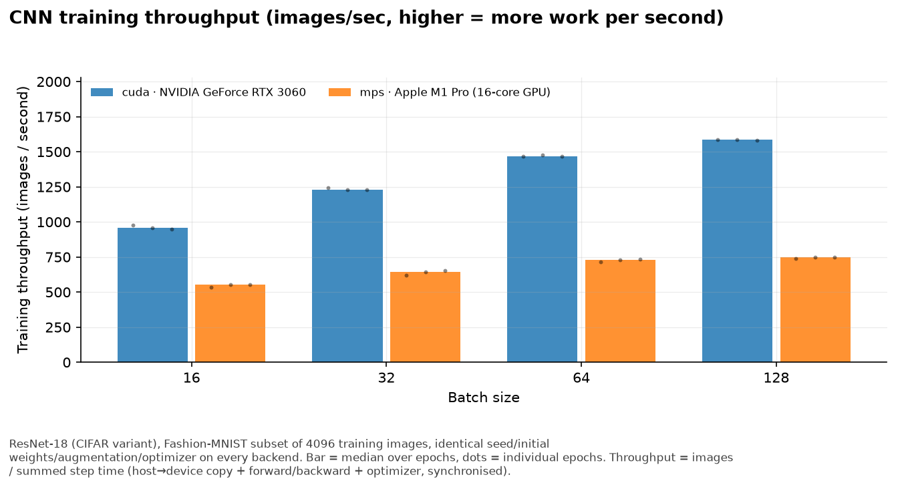
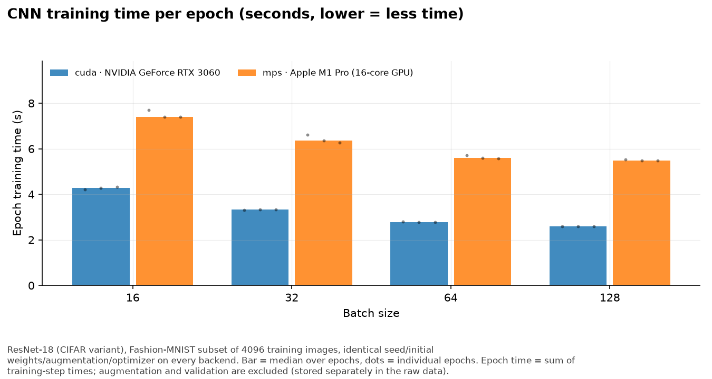

### Transformer training

Values: median tokens/s.

| batch_size | sequence_length | cuda · NVIDIA GeForce RTX 3060 | mps · Apple M1 Pro (16-core GPU) |
|---|---|---|---|
| 8 | 128 | 121,354 | 49,905.8 |
| 8 | 256 | 134,980 | 55,274.2 |
| 8 | 512 | 141,402 | 53,104.4 |
| 16 | 128 | 143,655 | 58,765.7 |
| 16 | 256 | 149,717 | 60,055.3 |
| 16 | 512 | 138,309 | 54,816.0 |
| 32 | 128 | 164,162 | 64,494.9 |
| 32 | 256 | 154,633 | 62,535.8 |
| 32 | 512 | 143,958 | 54,504.0 |

Speedup vs **cuda · NVIDIA GeForce RTX 3060** (>1 = higher throughput than the baseline):

| batch_size | sequence_length | mps · Apple M1 Pro (16-core GPU) |
|---|---|---|
| 8 | 128 | 0.41 |
| 8 | 256 | 0.41 |
| 8 | 512 | 0.38 |
| 16 | 128 | 0.41 |
| 16 | 256 | 0.40 |
| 16 | 512 | 0.40 |
| 32 | 128 | 0.39 |
| 32 | 256 | 0.40 |
| 32 | 512 | 0.38 |

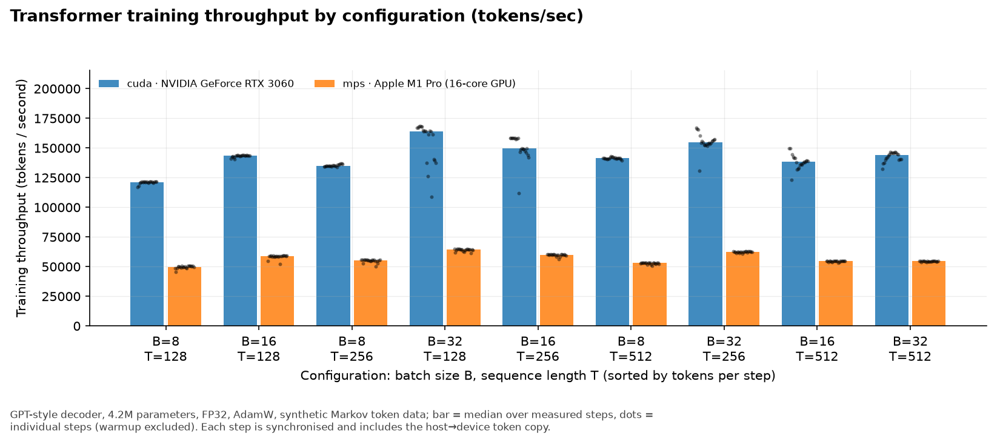
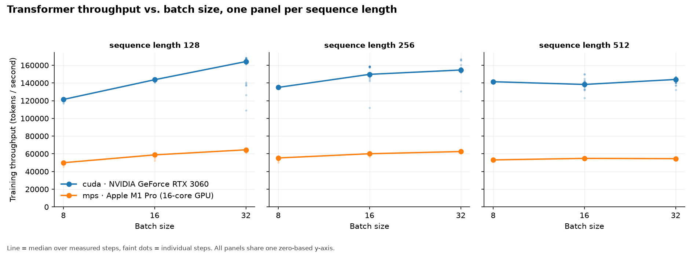

### Precision

Values: median throughput (GFLOPS for matmul_pure_dtype, tokens/s for training_autocast).

| workload | precision | cuda · NVIDIA GeForce RTX 3060 | mps · Apple M1 Pro (16-core GPU) |
|---|---|---|---|
| matmul_pure_dtype | bf16 | 23,941.4 | 2,228.6 |
| matmul_pure_dtype | fp16 | 23,998.4 | 4,653.1 |
| matmul_pure_dtype | fp32 | 7,599.4 | 4,011.7 |
| training_autocast | bf16 | 291,882 | 43,090.9 |
| training_autocast | fp16 | 283,008 | 47,914.1 |
| training_autocast | fp32 | 158,684 | 60,143.4 |

Speedup vs **cuda · NVIDIA GeForce RTX 3060** (>1 = higher throughput than the baseline):

| workload | precision | mps · Apple M1 Pro (16-core GPU) |
|---|---|---|
| matmul_pure_dtype | bf16 | 0.09 |
| matmul_pure_dtype | fp16 | 0.19 |
| matmul_pure_dtype | fp32 | 0.53 |
| training_autocast | bf16 | 0.15 |
| training_autocast | fp16 | 0.17 |
| training_autocast | fp32 | 0.38 |

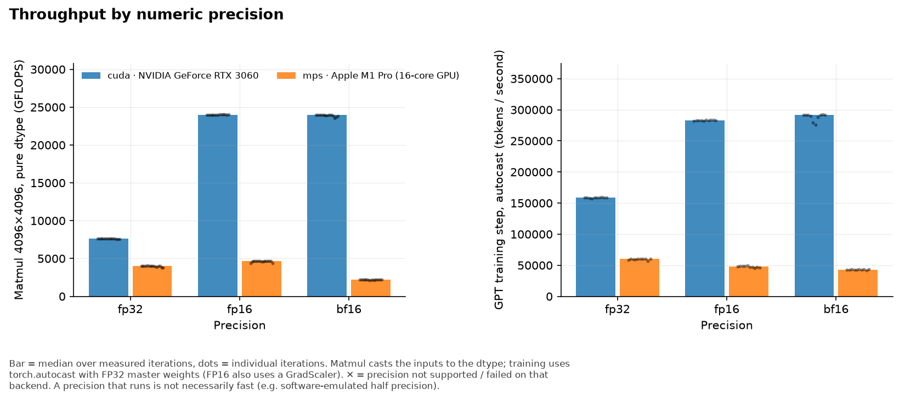

### Reinforcement learning (PPO / CartPole)

Values: median end-to-end environment steps/s (simulator + inference + update).

| hidden | cuda · NVIDIA GeForce RTX 3060 | mps · Apple M1 Pro (16-core GPU) |
|---|---|---|
| 64 | 9,448.1 | 4,997.2 |
| 512 | 9,106.8 | 4,478.5 |

Speedup vs **cuda · NVIDIA GeForce RTX 3060** (>1 = higher throughput than the baseline):

| hidden | mps · Apple M1 Pro (16-core GPU) |
|---|---|
| 64 | 0.53 |
| 512 | 0.49 |

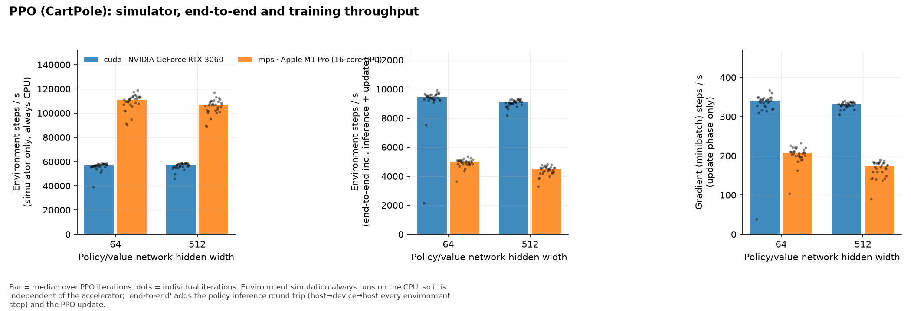
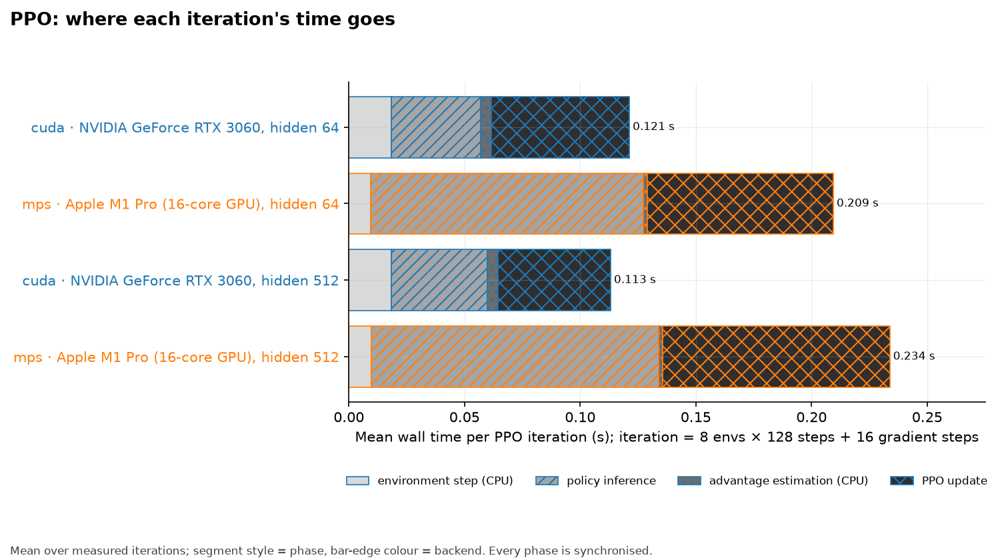

### Sustained training

Values: average tokens/s over the run; degradation compares first vs. last 10% of windows.

| metric | cuda · NVIDIA GeForce RTX 3060 | mps · Apple M1 Pro (16-core GPU) |
|---|---|---|
| avg_tokens_per_s | 139,755 | 59,358.7 |
| degradation_pct (positive = slower at the end) | 4.1 | -0.2 |
| duration_min | 10.0 | 10.0 |

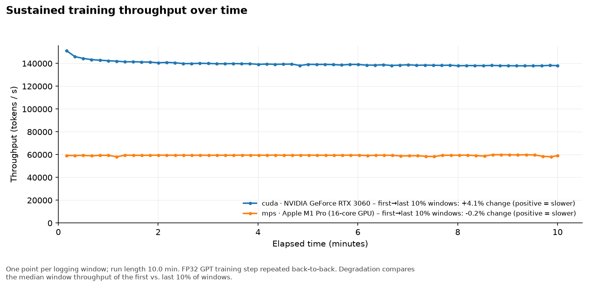

### Memory scaling: largest successful configuration

How *large* a workload fits, not how fast it runs; depends on the device's memory capacity.

| series | ladder | largest_ok_model | largest_ok_batch | largest_ok_seq | largest_ok_params_M | memory_mb_at_largest_ok | ladder_ended_by |
|---|---|---|---|---|---|---|---|
| cuda · NVIDIA GeForce RTX 3060 | batch_size | small | 256.0 | 256.0 | 4.3 | 8,394.2 | oom (OutOfMemoryError) at small bs=512 seq=256 |
| cuda · NVIDIA GeForce RTX 3060 | model | xl | 8.0 | 256.0 | 206.0 | 4,568.3 | ladder ceiling reached (no failure) |
| cuda · NVIDIA GeForce RTX 3060 | sequence_length | small | 8.0 | 4,096.0 | 5.3 | 4,240.9 | ladder ceiling reached (no failure) |
| mps · Apple M1 Pro (16-core GPU) | batch_size | small | 256.0 | 256.0 | 4.3 | 11,560.7 | oom (SafetyCapSystemMemory) at small bs=512 seq=256 |
| mps · Apple M1 Pro (16-core GPU) | model | xl | 8.0 | 256.0 | 206.0 | 6,266.8 | ladder ceiling reached (no failure) |
| mps · Apple M1 Pro (16-core GPU) | sequence_length | small | 8.0 | 4,096.0 | 5.3 | 17,538.7 | ladder ceiling reached (no failure) |

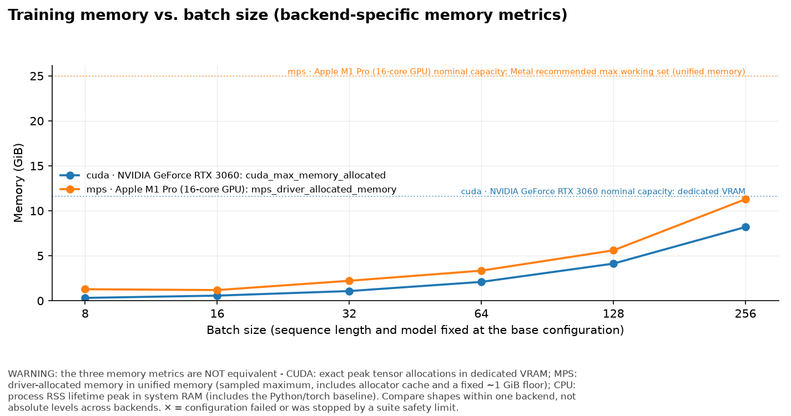
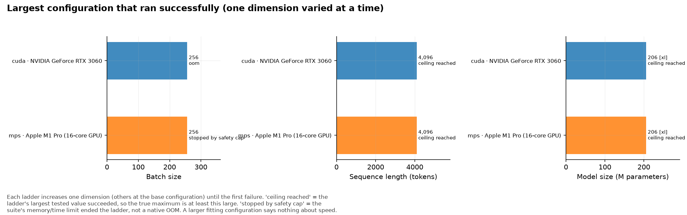
